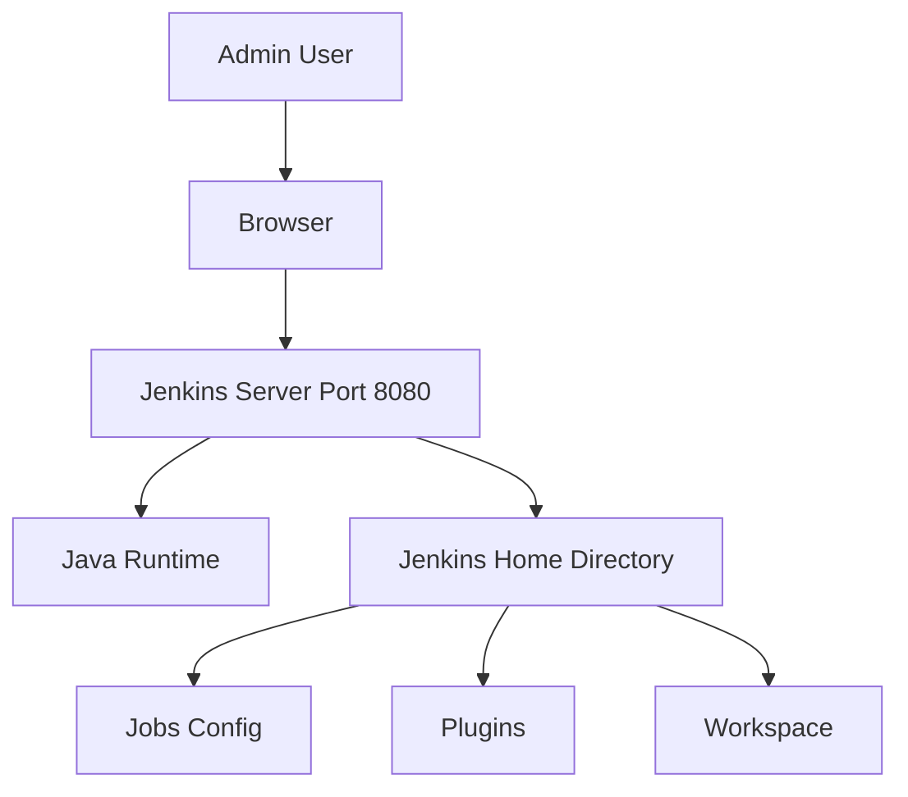
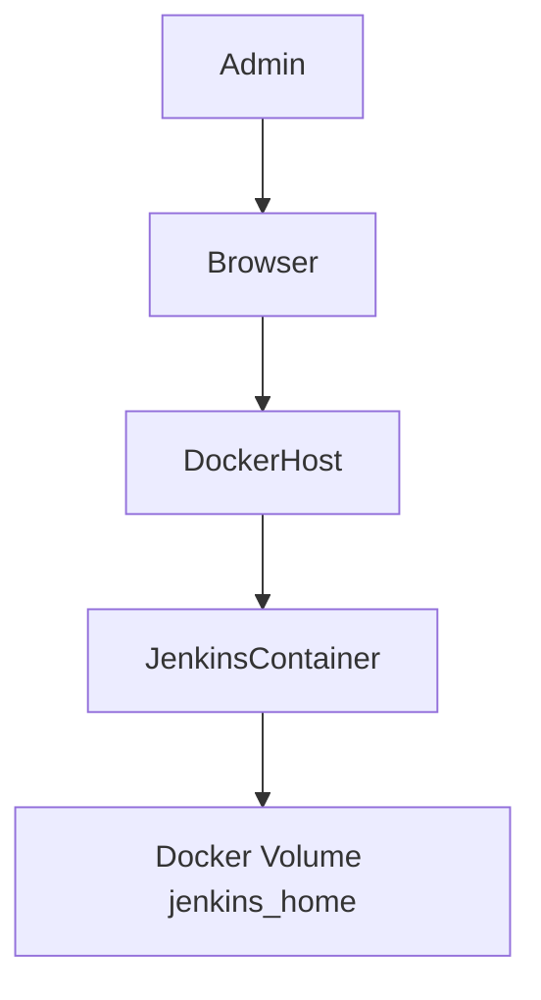

# Jenkins Installation Guide

## Introduction

Installing Jenkins correctly is foundational. A poor installation decision leads to performance issues, upgrade failures, and security risks later.

This guide covers:

* System requirements
* Installation on Linux
* Docker-based installation
* Initial setup
* Production-grade considerations

The focus is practical deployment, not just getting Jenkins running.

---

# System Requirements

Minimum requirements for learning:

* 2 GB RAM
* 2 vCPU
* 20 GB Disk
* Java 17

Recommended for production:

* 8 GB RAM or more
* 4+ vCPU
* SSD storage
* Separate disk for `/var/lib/jenkins`

Verify Java:

```bash
java -version
```

Jenkins requires **Java 17 or later**.

---

# Installation Methods Overview

| Method                   | Use Case               | Pros                   | Cons                   |
| ------------------------ | ---------------------- | ---------------------- | ---------------------- |
| Native Package (apt/yum) | Traditional servers    | Simple setup           | Less portable          |
| Docker                   | Dev, Cloud, Containers | Isolated, reproducible | Needs Docker knowledge |
| WAR File                 | Custom setups          | Flexible               | Manual management      |

---

# Method 1: Install Jenkins on Ubuntu/Debian (Recommended for Learning)

## Step 1: Install Java

```bash
sudo apt update
sudo apt install openjdk-17-jdk -y
```

Verify:

```bash
java -version
```

---

## Step 2: Add Jenkins Repository

```bash
curl -fsSL https://pkg.jenkins.io/debian-stable/jenkins.io-2023.key | sudo tee \
  /usr/share/keyrings/jenkins-keyring.asc > /dev/null
```

```bash
echo deb [signed-by=/usr/share/keyrings/jenkins-keyring.asc] \
  https://pkg.jenkins.io/debian-stable binary/ | sudo tee \
  /etc/apt/sources.list.d/jenkins.list > /dev/null
```

---

## Step 3: Install Jenkins

```bash
sudo apt update
sudo apt install jenkins -y
```

---

## Step 4: Start and Enable Service

```bash
sudo systemctl start jenkins
sudo systemctl enable jenkins
```

Check status:

```bash
sudo systemctl status jenkins
```

---

## Step 5: Access Jenkins

Open browser:

```
http://<server-ip>:8080
```

Default port: **8080**

If firewall is enabled:

```bash
sudo ufw allow 8080
```

---

## Step 6: Unlock Jenkins

Retrieve initial admin password:

```bash
sudo cat /var/lib/jenkins/secrets/initialAdminPassword
```

Paste into browser.

---

## Step 7: Install Suggested Plugins

Choose:

* Install Suggested Plugins

Wait for installation to complete.

---

## Step 8: Create Admin User

Provide:

* Username
* Password
* Email

Avoid using default admin user long term.

---

# Installation Architecture Diagram



---

# Method 2: Install Jenkins Using Docker

Recommended for:

* Dev environments
* Quick setup
* Isolated lab testing

## Step 1: Install Docker

```bash
sudo apt update
sudo apt install docker.io -y
sudo systemctl start docker
sudo systemctl enable docker
```

---

## Step 2: Run Jenkins Container

```bash
docker run -d \
  --name jenkins \
  -p 8080:8080 \
  -p 50000:50000 \
  -v jenkins_home:/var/jenkins_home \
  jenkins/jenkins:lts
```

Explanation:

* 8080 → Web UI
* 50000 → Agent communication
* Volume persists data

Check logs:

```bash
docker logs -f jenkins
```

---

## Docker-Based Architecture



If volume is deleted, configuration is lost.

---

# Method 3: Run Jenkins WAR File (Advanced)

Download:

```bash
wget https://get.jenkins.io/war-stable/latest/jenkins.war
```

Run:

```bash
java -jar jenkins.war
```

Used for:

* Testing custom JVM parameters
* Embedded scenarios
* Temporary environments

Not recommended for production.

---

# Production Installation Considerations

## 1. Dedicated Service Account

Never run Jenkins as root.

Default package installation creates:

```
jenkins
```

user.

---

## 2. Separate Disk for Jenkins Home

Mount separate disk:

```bash
/var/lib/jenkins
```

Prevents data loss during OS upgrades.

---

## 3. Reverse Proxy Setup

Use:

* Nginx
* Apache
* Load Balancer

Example Nginx snippet:

```nginx
server {
    listen 80;
    server_name jenkins.example.com;

    location / {
        proxy_pass http://localhost:8080;
    }
}
```

---

## 4. HTTPS Configuration

Use:

* Let's Encrypt
* Corporate SSL certificate

Never expose Jenkins publicly over HTTP in production.

---

## 5. Change Default Port (Optional)

Edit:

```bash
/etc/default/jenkins
```

Modify:

```
HTTP_PORT=9090
```

Restart:

```bash
sudo systemctl restart jenkins
```

---

# Initial Configuration Best Practices

After installation:

1. Configure security realm
2. Disable anonymous access
3. Configure global tool configuration
4. Install only required plugins
5. Configure backup strategy

---

# Backup Strategy Immediately After Setup

Backup Jenkins home:

```bash
tar -czvf jenkins-backup.tar.gz /var/lib/jenkins
```

Automate via cron.

Without backup, Jenkins is a single point of failure.

---

# Troubleshooting

## Jenkins Not Starting

Check logs:

```bash
sudo journalctl -u jenkins
```

Common causes:

* Java version mismatch
* Port already in use
* Corrupted plugin

---

## Port 8080 Already Used

Check:

```bash
sudo lsof -i :8080
```

Kill conflicting process or change Jenkins port.

---

## Permission Issues

Ensure:

```bash
sudo chown -R jenkins:jenkins /var/lib/jenkins
```

---

# Real-World Use Case

A startup deployed Jenkins directly on a production app server.

Problems:

* Resource contention
* App downtime during builds
* Security exposure

Resolution:

* Separate VM for Jenkins
* Dedicated build agents
* Reverse proxy with HTTPS
* Automated daily backups

Stability improved immediately.

---

# Pro-Tip

Installation decisions define long-term maintainability.

For learning:

* Use Docker.

For production:

* Dedicated server
* Reverse proxy
* Backup automation
* Secure configuration from day one

Never treat Jenkins installation as temporary infrastructure. It becomes mission critical within weeks.
