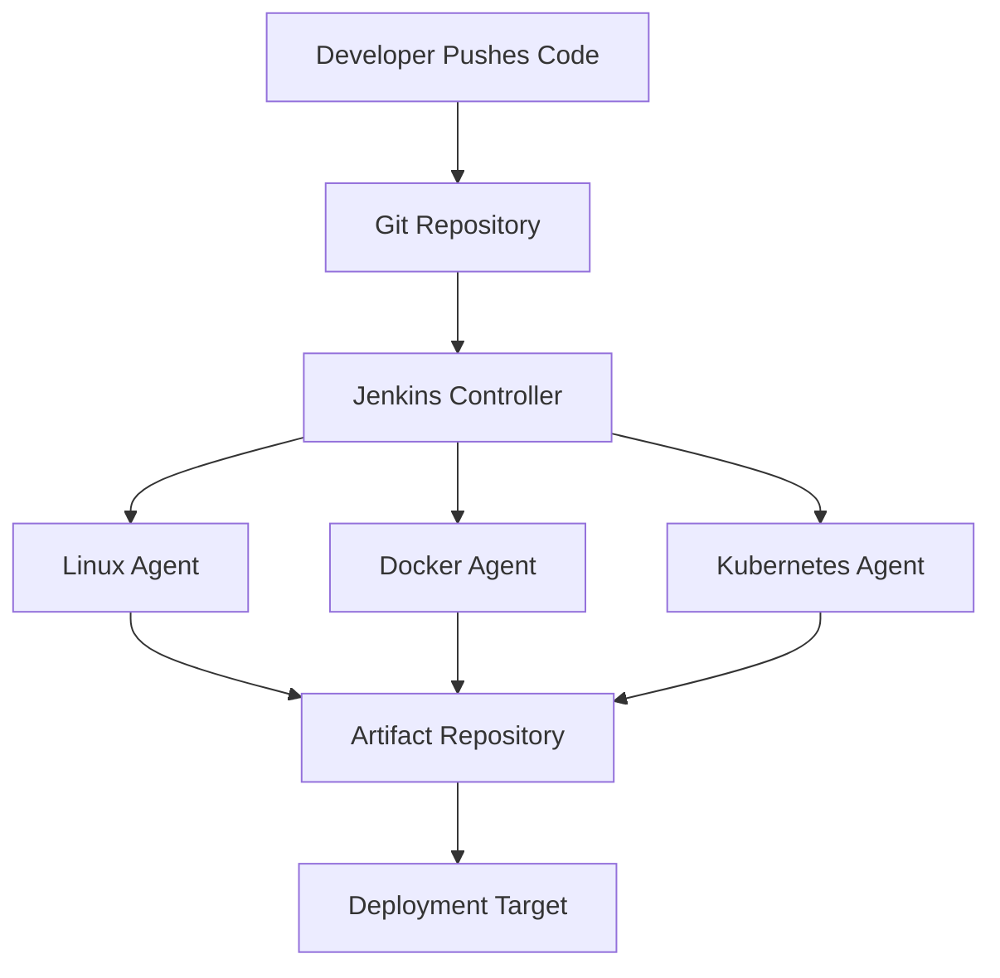
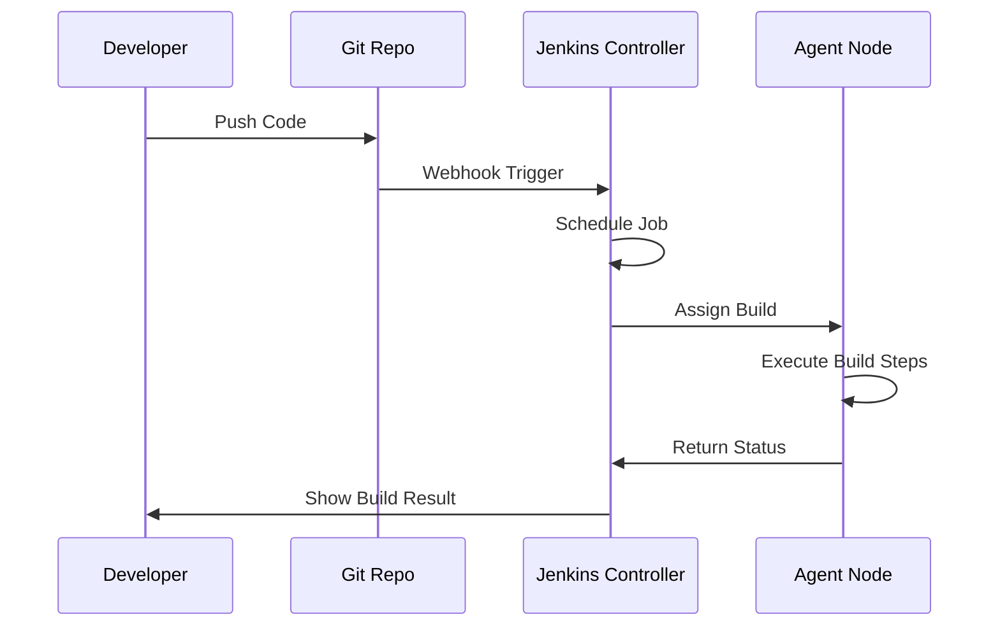
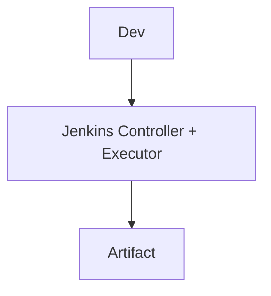
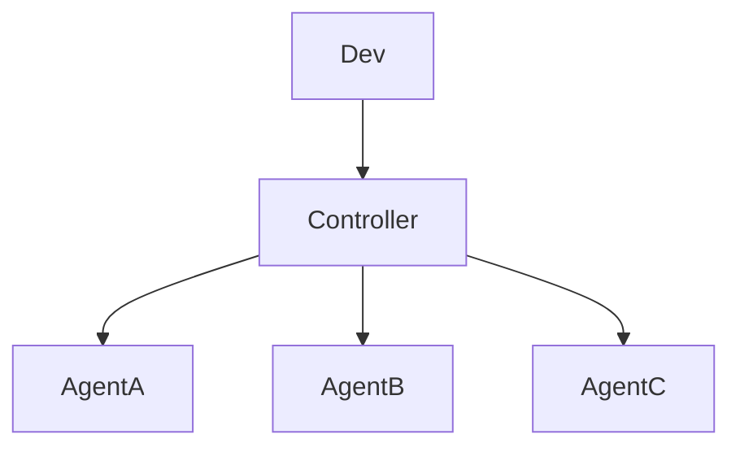
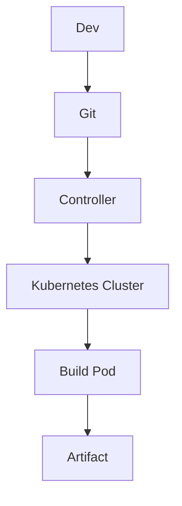

# Jenkins Architecture

## Introduction

Understanding **Jenkins architecture** is critical before designing pipelines or scaling builds. Jenkins is not just a CI server; it is a distributed automation engine built around extensibility, plugins, and remote execution.

At its core, Jenkins follows a **Controller–Agent architecture** (formerly called Master–Slave). The controller orchestrates work. Agents execute builds.

---

## Core Components of Jenkins Architecture

### 1. Jenkins Controller

The **Controller** is the brain of Jenkins.

Responsibilities:

* Managing jobs and pipelines
* Scheduling builds
* Maintaining build history
* Hosting the web UI
* Managing plugins
* Distributing work to agents

Important system location:

```bash
/var/lib/jenkins/
```

This directory contains:

* jobs/
* plugins/
* workspace/
* config.xml

If this directory is lost, Jenkins configuration is lost.

---

### 2. Jenkins Agents

**Agents** are worker machines that execute build steps.

They:

* Run shell commands
* Compile code
* Run tests
* Build Docker images
* Deploy artifacts

Agents can be:

* Static (permanent machines)
* Dynamic (Docker containers, Kubernetes pods)
* Cloud-based (AWS EC2, Azure VM, etc.)

---

## High-Level Architecture Diagram



Flow explanation:

1. Developer pushes code.
2. Jenkins detects change.
3. Controller schedules build.
4. Agent executes tasks.
5. Artifact is stored.
6. Deployment happens.

---

## Internal Build Execution Flow



The controller never executes heavy workloads in production setups. Agents handle execution.

---

## Master–Agent Communication

Jenkins agents connect to the controller using:

* **SSH**
* **JNLP (Java Web Start)**
* **Inbound Agent Protocol**
* Cloud connectors (Kubernetes plugin, EC2 plugin)

In production environments:

* Agents initiate connection to controller (recommended)
* Controller does not open unnecessary ports

---

## Jenkins Core Architecture Layers

Jenkins architecture consists of three logical layers:

### 1. Web Layer

* UI served on port **8080**
* REST API
* Authentication layer

### 2. Job Execution Layer

* Build queue
* Executor threads
* Workspace allocation

### 3. Plugin Layer

* Git plugin
* Pipeline plugin
* Docker plugin
* Kubernetes plugin

Everything in Jenkins is driven by plugins. Even Pipeline support is plugin-based.

---

## Executors and Workspaces

Each agent has:

* **Executors**: Number of parallel builds it can run
* **Workspace**: Directory where code is checked out

Example:

If an agent has 4 executors:

* It can run 4 builds simultaneously.

Workspace example:

```bash
/var/lib/jenkins/workspace/my-app/
```

---

## Single Node vs Distributed Setup

### Single Node Setup

Controller and build execution on same machine.



Used for:

* Learning
* Small teams
* Proof of concept

Risk:

* Resource exhaustion
* No isolation
* No scalability

---

### Distributed Setup

Controller separated from execution nodes.



Used for:

* Enterprise environments
* Multiple tech stacks
* Parallel builds
* High scalability

---

## Comparison: Controller vs Agent

| Component                | Controller      | Agent |
| ------------------------ | --------------- | ----- |
| Runs UI                  | Yes             | No    |
| Stores job configuration | Yes             | No    |
| Executes build steps     | Not recommended | Yes   |
| Manages plugins          | Yes             | No    |
| Handles scheduling       | Yes             | No    |
| Scalable horizontally    | Limited         | Yes   |

---

## Jenkins in Cloud-Native Architecture

Modern setups avoid static agents. Instead:

* Kubernetes plugin provisions dynamic pods
* Each build runs in isolated container
* Pods terminate after build completion

Architecture:



Advantages:

* No idle infrastructure
* Auto scaling
* Isolation per build

---

## Step-by-Step: Adding a Static Agent via SSH

### Step 1: Prepare Agent Machine

Install Java:

```bash
sudo apt update
sudo apt install openjdk-17-jdk -y
```

Create Jenkins user:

```bash
sudo useradd -m jenkins
```

### Step 2: Configure Node in Jenkins

1. Manage Jenkins
2. Manage Nodes and Clouds
3. New Node
4. Permanent Agent
5. Provide:

   * Remote root directory
   * Number of executors
   * Launch method: SSH
   * Credentials

### Step 3: Test Connection

Check node status:

* Should show "Connected"

---

## Scaling Strategy in Enterprise

Production architecture typically includes:

* Dedicated controller node
* Separate database for logs (optional)
* Backup strategy for /var/lib/jenkins
* Agents grouped by labels:

  * linux
  * docker
  * maven
  * nodejs

Example label usage in pipeline:

```groovy
pipeline {
    agent { label 'docker' }
    stages {
        stage('Build') {
            steps {
                sh 'docker build -t app .'
            }
        }
    }
}
```

---

## Common Architectural Mistakes

1. Running heavy builds on controller
2. Not backing up Jenkins home
3. Installing too many unnecessary plugins
4. Overloading single executor node
5. Ignoring agent isolation

---

## Best Practices

* Keep controller lightweight
* Use distributed agents
* Prefer containerized builds
* Monitor executor utilization
* Backup configuration regularly
* Use Infrastructure as Code for provisioning agents

---

## Real-World Use Case

A company with:

* Java applications
* Node.js microservices
* Dockerized deployments
* Kubernetes production cluster

They configured:

* One controller
* Linux agents for Maven builds
* Docker agents for image builds
* Kubernetes dynamic agents for test environments

Result:

* Parallel pipelines
* Reduced build time by 60 percent
* Isolated failures
* Scalable CI/CD infrastructure

---

## Pro-Tip

Jenkins architecture design determines:

* Build speed
* Stability
* Security
* Scalability

Poor architecture leads to unstable CI/CD. Strong separation between orchestration and execution ensures long-term reliability.
