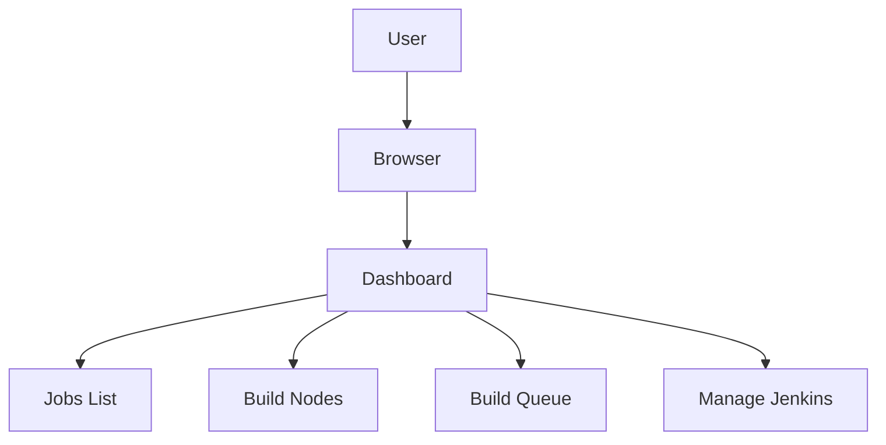
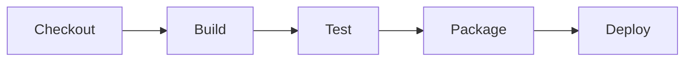
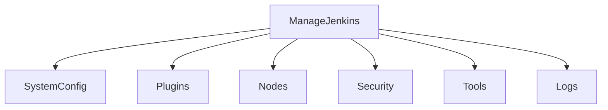
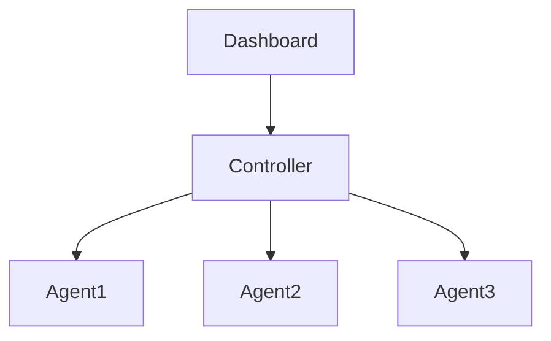

# Jenkins Dashboard Overview

## Introduction

The **Jenkins Dashboard** is the operational control center of Jenkins. Every build, pipeline, node, plugin, and configuration starts or is monitored from here.

Understanding the dashboard is critical for:

* Monitoring build health
* Managing jobs
* Troubleshooting failures
* Administering system configuration

For freshers, it may look simple. In production, it represents system health.

---

# High-Level Dashboard Layout

When you log into Jenkins:

```
http://<server-ip>:8080
```

You see:

* Top navigation bar
* Side navigation panel
* Job list view
* Build status indicators

---

## Dashboard Architecture View



Each section has operational importance.

---

# Core Sections Explained

## 1. Top Navigation Bar

Located at top of UI.

Contains:

* New Item
* People
* Build History
* Manage Jenkins
* My Views

Purpose:

* Entry point for job creation
* Access to administration
* Quick navigation

---

## 2. Side Panel (Left Sidebar)

Context-aware menu.

Options vary based on selection.

Example when on main dashboard:

* New Item
* Manage Jenkins
* My Views
* Credentials
* Build Queue

---

## 3. Jobs List

Displays all configured jobs and pipelines.

Columns:

* Job Name
* Status icon
* Last Build
* Last Success
* Last Failure
* Build Duration

Color codes:

* Blue or Green: Successful
* Red: Failed
* Yellow: Unstable
* Grey: Disabled or Not Built

In some setups blue indicates success due to legacy UI conventions.

---

## 4. Build Queue

Shows:

* Jobs waiting for executor
* Blocked builds
* Scheduled builds

Queue delays indicate:

* Insufficient executors
* Agent connectivity issues
* Resource exhaustion

---

## 5. Build Executor Status

Shows:

* Active builds
* Which agent is executing
* Build duration

If controller shows heavy executor usage, architecture is misconfigured.

---

# Job View Breakdown

Clicking a job opens:

* Build history
* Console output
* Configure option
* Workspace link
* Pipeline stages (if pipeline job)

---

## Pipeline Visualization

For pipeline jobs:



Each stage:

* Has status
* Shows duration
* Displays logs

This helps identify bottlenecks quickly.

---

# Manage Jenkins Section

Critical administrative area.

Contains:

* Configure System
* Global Tool Configuration
* Plugin Manager
* Manage Nodes and Clouds
* Credentials
* System Information
* Script Console

Only admins should access this section.

---

## Manage Jenkins Architecture Map



Misconfiguration here affects entire CI/CD pipeline.

---

# Key Dashboard Indicators

## 1. Weather Icon

Represents job stability based on recent builds.

* Sunny: Stable
* Cloudy: Some failures
* Stormy: Frequent failures

Used as quick health indicator.

---

## 2. Build Trends Graph

Shows:

* Success vs failure rate
* Performance trends
* Duration spikes

Increasing build time usually indicates:

* Growing codebase
* Inefficient test cases
* Resource limits

---

# Step-by-Step: Creating First Job from Dashboard

1. Click **New Item**
2. Enter job name
3. Choose:

   * Freestyle Project
   * Pipeline
4. Click OK
5. Configure SCM
6. Add build steps
7. Save
8. Click Build Now

Job appears in dashboard list.

---

# Views in Dashboard

Views help organize jobs.

Default view: **All**

Create custom view:

1. Click New View
2. Choose List View
3. Select jobs
4. Save

Use cases:

* Separate dev and prod pipelines
* Group microservices
* Team-specific dashboards

---

# Dashboard in Distributed Setup

In enterprise setup:



Dashboard shows:

* Agent status
* Online/offline nodes
* Executor utilization

Offline agents appear disconnected.

---

# Common Beginner Mistakes

1. Ignoring build failures
2. Running builds manually instead of configuring triggers
3. Overloading controller executors
4. Not monitoring queue delays
5. Installing too many plugins without review

Dashboard signals these problems early.

---

# Best Practices

* Keep dashboard clean and organized
* Use views to separate environments
* Monitor build queue regularly
* Track build duration trends
* Restrict admin access
* Disable unused jobs
* Remove obsolete pipelines

Operational discipline begins at dashboard level.

---

# Real-World Use Case

A mid-sized team noticed frequent production bugs.

Dashboard analysis showed:

* High unstable build percentage
* Ignored failed tests
* Long-running builds queued for hours

Action taken:

* Increased agents
* Enforced test failure blocking
* Optimized test suite

Result:

* 40 percent reduction in release failures
* Faster feedback loop

Dashboard was the diagnostic source.

---

# Pro-Tip

The Jenkins dashboard is not decorative.

It is a live operational control surface.

If:

* Queue grows
* Agents disconnect
* Builds turn unstable
* Duration spikes

Investigate immediately.

Healthy dashboard equals healthy CI/CD pipeline.
