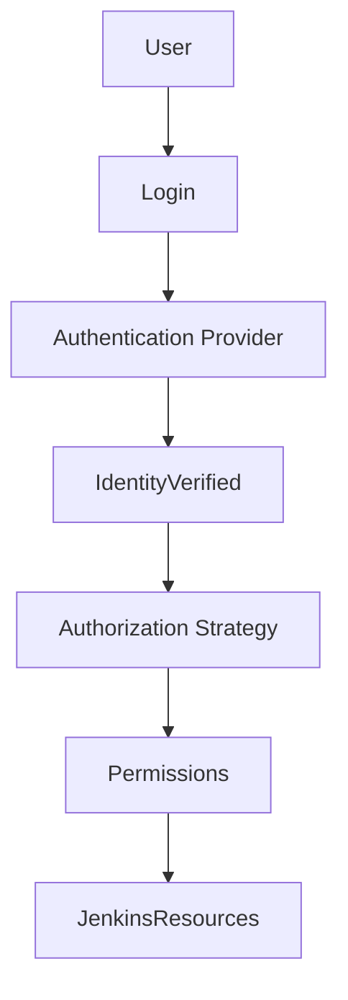
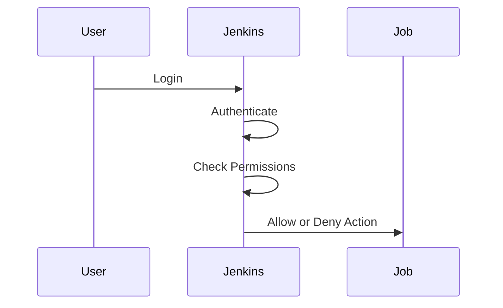

# User Management in Jenkins

## Introduction

**User management** in Jenkins defines who can access the system, what actions they can perform, and how authentication is handled.

Improper user management leads to:

* Unauthorized production deployments
* Credential leakage
* Accidental configuration changes
* Compliance violations

In real-world environments, Jenkins must never run with open anonymous access.

---

# Authentication vs Authorization

Two separate concepts:

* **Authentication** → Who are you?
* **Authorization** → What are you allowed to do?

Both must be configured correctly.

---

# Jenkins Security Architecture

If authentication is weak, system is exposed.
If authorization is weak, internal damage occurs.

---

# Step 1: Enable Security

Navigate:

**Manage Jenkins → Configure Global Security**

Enable:

* Enable Security
* Select Security Realm
* Select Authorization Strategy

Never leave security disabled.

---

# Security Realm (Authentication Options)

## 1. Jenkins’ Own User Database

Simple and suitable for:

* Learning
* Small teams

Configuration:

* Select "Jenkins’ own user database"
* Allow users to sign up (optional)
* Save

Create users manually under:

**Manage Jenkins → Manage Users**

---

## 2. LDAP Integration

Used in enterprises.

Benefits:

* Centralized user management
* Corporate SSO compatibility
* Compliance alignment

Requires:

* LDAP server details
* Manager DN
* Password
* Root DN

---

## 3. Active Directory Integration

Common in corporate Windows environments.

Allows:

* Domain user authentication
* Group-based access mapping

---

# Authorization Strategies

## 1. Matrix-Based Security

Granular control over:

* Job permissions
* Build permissions
* Admin access
* Credential usage

Recommended for small to mid-sized teams.

---

## 2. Role-Based Strategy Plugin (RBAC)

Advanced access control.

* Define roles
* Assign permissions to roles
* Map users to roles

Best for large organizations.

---

# Permissions Breakdown

Common permissions include:

| Permission         | Description             |
| ------------------ | ----------------------- |
| Overall/Administer | Full control            |
| Job/Read           | View job                |
| Job/Build          | Trigger builds          |
| Job/Configure      | Modify job              |
| Credentials/View   | View stored credentials |
| Credentials/Create | Add credentials         |
| Run/Delete         | Delete builds           |

Never give **Administer** permission casually.

---

# Example: Matrix-Based Configuration

1. Go to **Manage Jenkins**
2. Click **Configure Global Security**
3. Select **Matrix-based security**
4. Add user
5. Assign minimal required permissions

Example principle:

* Developers → Build + Read
* DevOps → Configure + Build
* Admin → Full access

Follow least privilege model.

---

# User Creation (Internal Database)

Steps:

1. Manage Jenkins
2. Manage Users
3. Create User
4. Enter:

   * Username
   * Password
   * Full Name
   * Email
5. Save

Avoid weak passwords.

---

# Permission Flow in Job Execution

If authorization fails, action is blocked.

---

# Folder-Level Security

When using folders:

* Permissions can be assigned per folder
* Different teams can manage their own pipelines

Example:

* Dev Team → Access only dev folder
* Prod Team → Access production folder

Improves isolation.

---

# Integration with Git Providers

When using GitHub or GitLab:

* Jenkins authentication remains separate
* SCM credentials are stored separately
* Do not rely on SCM access for Jenkins authorization

Keep authentication boundaries clear.

---

# Common Security Mistakes

1. Leaving anonymous read enabled
2. Using shared admin account
3. Giving developers full admin rights
4. Not rotating user passwords
5. Hardcoding credentials in pipelines
6. Ignoring audit requirements

---

# Best Practices

* Enable security immediately after installation
* Use centralized authentication (LDAP/AD) in enterprise
* Follow least privilege principle
* Separate dev, staging, prod access
* Regularly audit permissions
* Disable unused accounts
* Avoid using personal accounts for automation

---

# Real-World Use Case

A team allowed all developers admin access.

Result:

* Accidental plugin deletion
* Production pipeline misconfiguration
* Broken build history
* Audit failure during compliance review

Resolution:

* Implemented role-based access
* Restricted production folder access
* Enforced centralized authentication
* Enabled audit logging

Security posture improved immediately.

---

# Pro-Tip

User management is not about convenience. It is about control.

Every user in Jenkins represents:

* Deployment authority
* Credential access
* Infrastructure impact

Treat Jenkins as a production control plane, not a shared playground.
