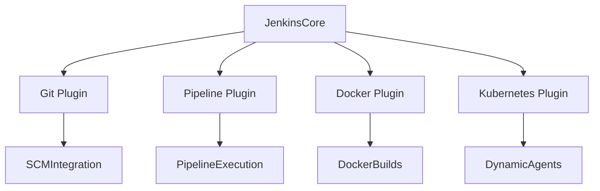
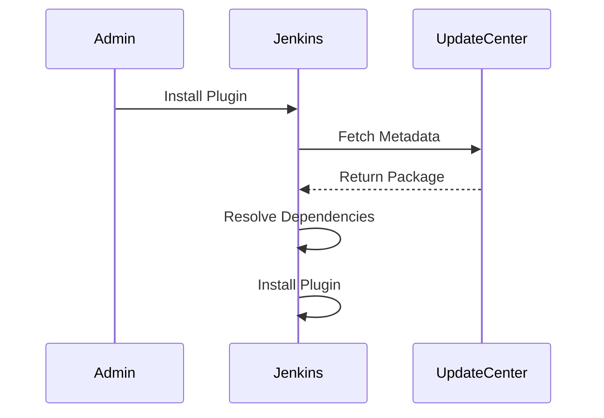
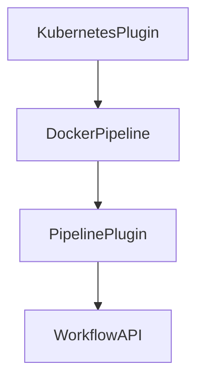

# Plugin Administration in Jenkins

## Introduction

**Plugins** are the backbone of Jenkins. Almost every feature in Jenkins, including Pipeline, Git integration, Docker support, and Kubernetes integration, is delivered through plugins.

Poor plugin management leads to:

* Build instability
* Security vulnerabilities
* Upgrade failures
* Performance degradation

Plugin administration must be disciplined and controlled.

---

# How Jenkins Plugin Architecture Works

Jenkins core provides basic functionality. Plugins extend it.



Plugins depend on:

* Jenkins core version
* Other plugins
* Specific APIs

Dependency conflicts are common in unmanaged environments.

---

# Accessing Plugin Manager

Navigate:

**Manage Jenkins → Manage Plugins**

Tabs available:

* Updates
* Available
* Installed
* Advanced

---

# Installing Plugins

## Method 1: Install from Available Tab

Steps:

1. Go to **Available**
2. Search plugin name
3. Select plugin
4. Click **Install without restart** or **Download now and install after restart**

Prefer installing during maintenance window in production.

---

## Method 2: Install Using .hpi File (Offline Installation)

Download plugin file externally.

Then:

1. Go to **Advanced**
2. Upload `.hpi` file
3. Install

Used in restricted environments without internet.

---

# Plugin Installation Flow



Dependency resolution is automatic but not always conflict-free.

---

# Updating Plugins

Outdated plugins are security risks.

Steps:

1. Go to **Updates**
2. Review available updates
3. Select required plugins
4. Install updates
5. Restart Jenkins if required

Never update all plugins blindly in production.

---

# Removing Plugins

Steps:

1. Go to **Installed**
2. Select plugin
3. Click **Uninstall**

If uninstall fails:

* Restart Jenkins
* Remove plugin manually from:

```bash
/var/lib/jenkins/plugins/
```

Then restart.

Be cautious. Removing core plugins may break pipelines.

---

# Important Production Plugins

Common essential plugins:

* Git Plugin
* Pipeline Plugin
* Credentials Plugin
* SSH Agent Plugin
* Docker Pipeline Plugin
* Kubernetes Plugin
* Role-Based Authorization Strategy Plugin

Install only what is required.

---

# Plugin Dependency Model



If base plugin updates, dependent plugins may break.

---

# Plugin Version Strategy

Three common strategies:

| Strategy           | Description               | Risk Level |
| ------------------ | ------------------------- | ---------- |
| Always Latest      | Update immediately        | High       |
| LTS Aligned        | Match Jenkins LTS version | Medium     |
| Controlled Upgrade | Test in staging first     | Low        |

Enterprise environments use controlled upgrades.

---

# Checking Plugin Health

Go to:

**Manage Jenkins → System Information**

Look for:

* Failed plugins
* Dependency errors
* Incompatible versions

Monitor logs:

```bash
sudo journalctl -u jenkins
```

Or:

```bash
docker logs jenkins
```

---

# Safe Plugin Upgrade Process

1. Backup Jenkins home
2. Clone production to staging
3. Apply plugin updates in staging
4. Run sample pipelines
5. Validate builds
6. Upgrade production during maintenance window

Skipping staging is operational negligence.

---

# Plugin Performance Impact

Excess plugins increase:

* Memory usage
* Startup time
* Attack surface
* UI latency

Audit plugins periodically.

---

# Common Plugin Problems

## 1. Jenkins Fails to Start After Update

Cause:

* Incompatible plugin version

Solution:

* Remove updated plugin from `/plugins` directory
* Restore backup
* Restart

---

## 2. Pipeline Syntax Errors After Upgrade

Cause:

* Pipeline plugin update changed API

Solution:

* Review release notes
* Roll back plugin version

---

## 3. Agent Connection Failures

Cause:

* Remoting plugin mismatch

Solution:

* Update agents
* Align plugin versions

---

# Best Practices

* Use Jenkins LTS version
* Limit plugin count
* Avoid experimental plugins in production
* Track plugin inventory
* Review plugin security advisories
* Remove unused plugins
* Pin plugin versions if required

---

# Real-World Use Case

A team installed 60+ plugins over two years.

Problems observed:

* Jenkins startup time increased to 8 minutes
* Memory usage exceeded 12 GB
* Frequent plugin conflicts
* Upgrade failures

Action taken:

* Audited plugins
* Removed 30 unused plugins
* Standardized plugin versions
* Created staging environment

Result:

* Startup time reduced by 70 percent
* Stable upgrade cycles
* Reduced security exposure

---

# Pro-Tip

Plugins define Jenkins capability. They also define its fragility.

Every plugin:

* Adds functionality
* Adds dependency
* Adds risk

Treat plugin management as software lifecycle management, not feature experimentation.
