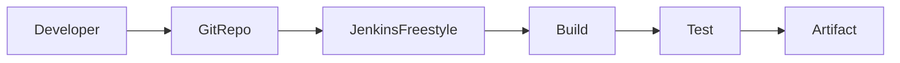
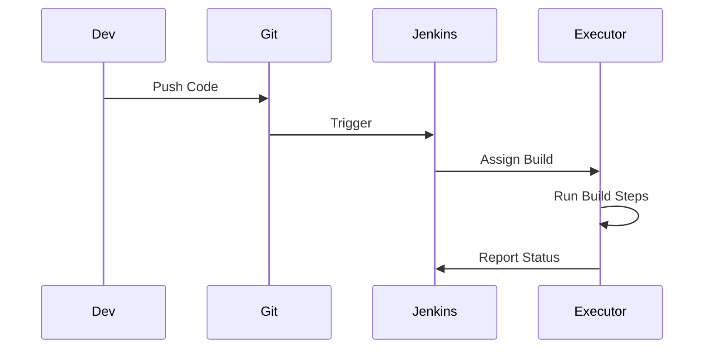

# Freestyle Projects in Jenkins

## Introduction

A **Freestyle Project** is the most basic job type in Jenkins. It provides a graphical configuration interface where you define:

* Source code repository
* Build steps
* Post-build actions
* Triggers

Freestyle projects are suitable for:

* Simple automation
* Learning CI fundamentals
* Legacy jobs
* Small independent tasks

In modern DevOps, they are often replaced by **Pipeline as Code**, but understanding them is essential.

---

# Where Freestyle Fits in CI/CD



Freestyle automates a linear set of tasks.

---

# Creating a Freestyle Project

## Step 1: Create Job

1. Click **New Item**
2. Enter name
3. Select **Freestyle Project**
4. Click OK

---

## Step 2: Configure Source Code Management (SCM)

Under **Source Code Management**:

* Select **Git**
* Provide repository URL
* Add credentials if private repo

Example:

```
https://github.com/example/java-app.git
```

---

## Step 3: Configure Build Triggers

Options:

* Build periodically
* Poll SCM
* GitHub hook trigger
* Build after other projects

Example Cron syntax:

```
H/5 * * * *
```

Runs every 5 minutes.

---

## Step 4: Add Build Steps

Common build step types:

* Execute Shell
* Invoke Maven
* Invoke Gradle
* Execute Windows batch command

Example Shell build step:

```bash
mvn clean package
```

For Node.js:

```bash
npm install
npm run build
```

---

## Step 5: Add Post-Build Actions

Common actions:

* Archive artifacts
* Publish JUnit results
* Send email notifications
* Build other projects
* Publish to artifact repository

Example artifact archiving:

* Files to archive:

  ```
  target/*.jar
  ```

---

# Freestyle Build Execution Flow



Freestyle does not define stages. It executes sequentially.

---

# Freestyle vs Pipeline

| Feature            | Freestyle Project | Pipeline         |
| ------------------ | ----------------- | ---------------- |
| Configuration      | UI Based          | Code Based       |
| Version Control    | Not versioned     | Stored in Git    |
| Complex Logic      | Limited           | Advanced         |
| Reusability        | Low               | High             |
| Parallel Execution | Difficult         | Native Support   |
| Best For           | Simple builds     | Enterprise CI/CD |

Freestyle is static. Pipeline is programmable.

---

# Example: Java Freestyle Build

Build Step:

```bash
mvn clean package -DskipTests=false
```

Post-Build Action:

* Archive: `target/*.jar`
* Publish JUnit: `target/surefire-reports/*.xml`

This creates a simple CI job.

---

# Example: Docker Build Freestyle

Build Step:

```bash
docker build -t myapp:${BUILD_NUMBER} .
```

Push image:

```bash
docker push myapp:${BUILD_NUMBER}
```

Freestyle handles environment variables like:

```
${BUILD_NUMBER}
${JOB_NAME}
```

---

# Environment Variables in Freestyle

Common variables:

* BUILD_NUMBER
* JOB_NAME
* WORKSPACE
* BUILD_ID
* NODE_NAME

Use in shell:

```bash
echo "Building ${JOB_NAME} - ${BUILD_NUMBER}"
```

---

# Limitations of Freestyle

1. No native stage visualization
2. Hard to maintain large workflows
3. Not stored in version control
4. Complex branching logic not supported
5. Difficult to reuse across jobs

Scaling Freestyle leads to configuration sprawl.

---

# Troubleshooting Common Issues

## 1. Git Checkout Fails

Check:

* Credentials
* Network access
* Correct branch

---

## 2. Maven Not Found

Ensure Maven is installed on agent:

```bash
mvn -v
```

Or configure under:

**Manage Jenkins → Global Tool Configuration**

---

## 3. Artifact Not Archived

Verify:

* Correct path
* File exists in workspace

Check workspace:

```bash
/var/lib/jenkins/workspace/<job-name>
```

---

# Best Practices

* Keep Freestyle jobs simple
* Avoid complex deployment logic
* Migrate critical workflows to Pipeline
* Use consistent naming conventions
* Archive artifacts explicitly
* Enable SCM triggers instead of manual builds
* Monitor build duration

---

# Real-World Use Case

A small startup with three developers:

* Single Java application
* No microservices
* Manual deployments

They used Freestyle for:

* Git checkout
* Maven build
* Artifact archiving

This reduced manual build errors and standardized packaging.

As the team grew:

* Multiple environments introduced
* Docker added
* Kubernetes deployment required

Freestyle became unmanageable.

They migrated to Pipeline as Code.

---

# Pro-Tip

Freestyle projects are foundational learning tools.

Use them to understand:

* Jenkins execution model
* Build steps
* Artifact handling
* Trigger mechanisms

Do not build enterprise CI/CD systems entirely on Freestyle. Transition to Pipeline early for scalability and maintainability.
