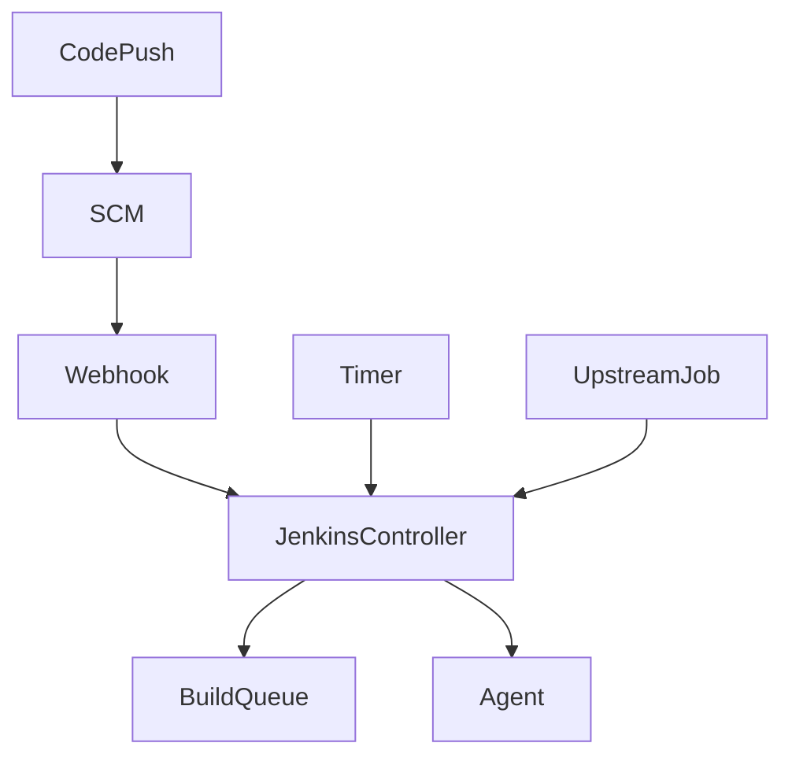
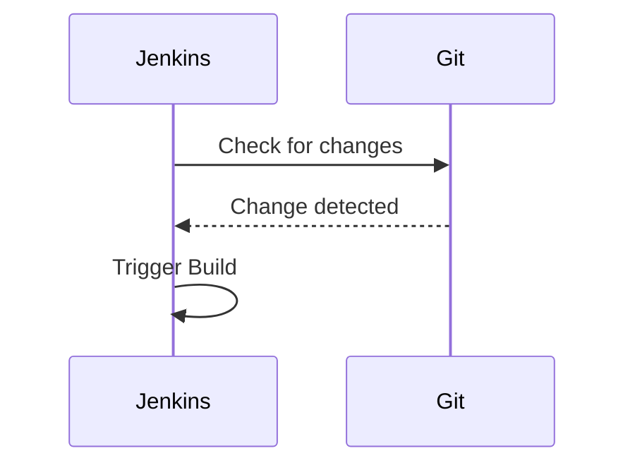
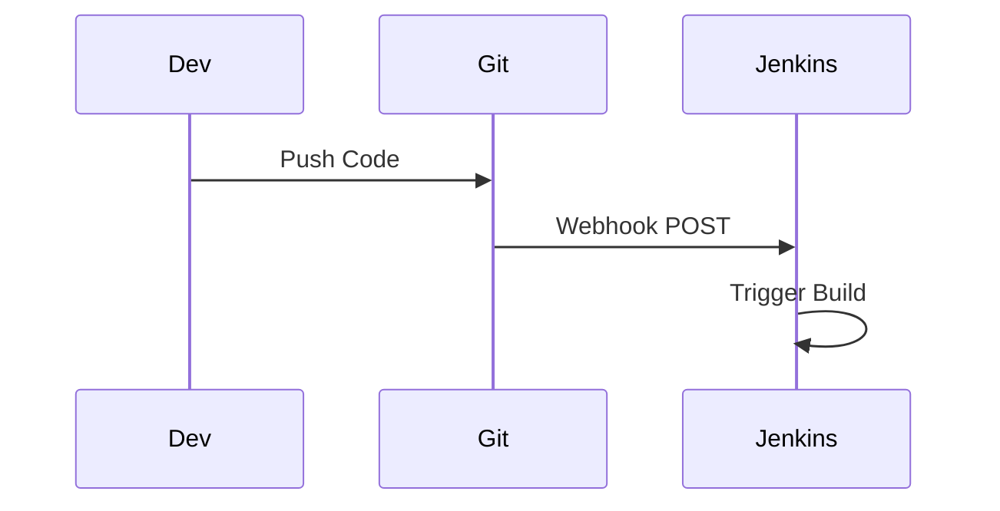
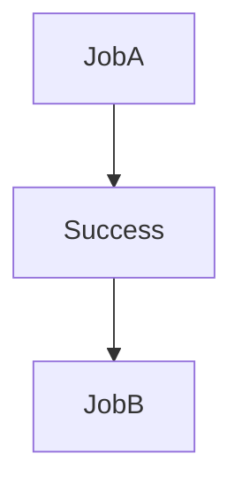
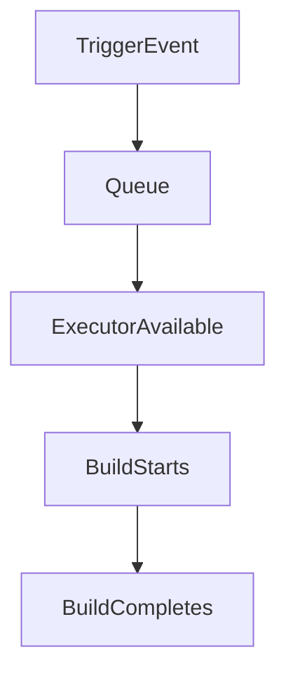

# Build Triggers and Schedules in Jenkins

## Introduction

**Build triggers** determine when a job runs. Without proper triggering strategy, CI/CD becomes either:

* Manual and slow
* Overloaded and inefficient
* Unpredictable

In real-world systems, triggers must balance:

* Immediate feedback
* Resource utilization
* System stability

This section explains how Jenkins schedules and triggers builds in both Freestyle and Pipeline jobs.

---

# Trigger Types Overview

Common trigger mechanisms:

* Manual Trigger
* SCM Polling
* Webhooks
* Scheduled Builds (Cron)
* Upstream/Downstream Triggers
* Remote Trigger via API

---

# Trigger Architecture Flow



Multiple trigger sources feed into the Jenkins build queue.

---

# 1. Manual Trigger

Triggered by clicking:

**Build Now**

Used for:

* Testing configuration
* Rebuilding failed job
* One-time execution

Not recommended as primary trigger strategy.

---

# 2. SCM Polling

Jenkins periodically checks repository for changes.

Configuration:

* Enable **Poll SCM**
* Add cron syntax

Example:

```
H/5 * * * *
```

Checks every 5 minutes.

Flow:



Downside:

* Wastes resources
* Not real-time

Prefer webhooks when possible.

---

# 3. Webhook Trigger (Recommended)

Git server sends HTTP request to Jenkins when code changes.

Supported by:

* GitHub
* GitLab
* Bitbucket

Example webhook URL:

```
http://jenkins-server:8080/github-webhook/
```

Webhook Flow:



Advantages:

* Immediate execution
* Efficient
* No polling overhead

Production systems rely on webhooks.

---

# 4. Scheduled Builds (Cron)

Used for:

* Nightly builds
* Cleanup jobs
* Scheduled testing
* Cost optimization scripts

Enable:

* Build periodically

Example:

```
0 2 * * *
```

Runs daily at 2 AM.

Cron Format:

```
MIN HOUR DOM MON DOW
```

Jenkins supports special character **H** for load balancing:

```
H 2 * * *
```

Distributes execution time across jobs.

---

# 5. Upstream/Downstream Trigger

Trigger job B after job A completes.

Configuration:

* In Job A → Post Build Actions
* Select **Build other projects**

Flow:



Used in:

* Multi-stage legacy pipelines
* Chained deployments

Pipeline is preferred over chained Freestyle jobs.

---

# 6. Remote Trigger via API

Trigger build using HTTP request.

Example:

```bash
curl -X POST \
  http://jenkins-server:8080/job/my-job/build \
  --user user:apiToken
```

Used for:

* External automation
* Integration with other systems
* ChatOps

API token required.

---

# Build Trigger Configuration in Pipeline

Declarative Pipeline example:

```groovy
pipeline {
    triggers {
        cron('H 3 * * 1-5')
    }
    agent any
    stages {
        stage('Build') {
            steps {
                sh 'echo Scheduled build'
            }
        }
    }
}
```

SCM polling example:

```groovy
triggers {
    pollSCM('H/10 * * * *')
}
```

---

# Trigger Execution Lifecycle



If no executor available, build waits in queue.

Queue growth indicates scaling problem.

---

# Avoiding Trigger Overload

Bad pattern:

* Polling every minute
* Multiple jobs polling same repo
* No executor scaling

Better pattern:

* Use webhooks
* Use H in cron
* Separate heavy nightly builds
* Scale agents

---

# Trigger Comparison

| Trigger Type | Real-Time   | Resource Efficient | Recommended           |
| ------------ | ----------- | ------------------ | --------------------- |
| Manual       | No          | Yes                | Limited               |
| Poll SCM     | Delayed     | No                 | Avoid if possible     |
| Webhook      | Yes         | Yes                | Preferred             |
| Cron         | Scheduled   | Yes                | For planned tasks     |
| Upstream     | Event-based | Yes                | For chained jobs      |
| Remote API   | On-demand   | Yes                | Controlled automation |

---

# Advanced: Quiet Period

Jenkins supports **Quiet Period**.

If multiple commits happen quickly:

* Jenkins waits before triggering build
* Prevents multiple builds

Configure under:

**Advanced Project Options**

Example: 30 seconds quiet period.

---

# Troubleshooting Trigger Issues

## Webhook Not Working

Check:

* Webhook URL reachable
* Jenkins accessible publicly or via reverse proxy
* Firewall rules
* Git webhook delivery logs

---

## Poll SCM Not Triggering

Verify:

* Correct branch
* Correct credentials
* Cron syntax valid
* SCM polling log

---

## Cron Not Executing

Check:

* Jenkins timezone
* Cron syntax correctness
* Jenkins server running
* Build not disabled

---

## Builds Stuck in Queue

Check:

* Available executors
* Agent connectivity
* Node labels mismatch

---

# Best Practices

* Use webhooks for SCM-based jobs
* Use cron only for scheduled tasks
* Avoid aggressive polling
* Monitor queue length
* Separate heavy jobs
* Use labels to distribute load
* Set quiet period for high-commit repositories

---

# Real-World Use Case

A team configured polling every minute across 25 microservices.

Result:

* High CPU usage on controller
* API rate limits hit on Git provider
* Random build delays

Resolution:

* Switched to webhooks
* Reduced polling
* Introduced quiet period
* Scaled agents

Controller CPU dropped by 60 percent.

---

# Pro-Tip

Trigger strategy defines feedback speed.

Poor trigger design causes:

* Resource exhaustion
* Delayed builds
* Developer frustration

Design triggers intentionally:

* Real-time for application code
* Scheduled for maintenance
* Controlled for deployments

CI/CD efficiency begins with trigger discipline.
