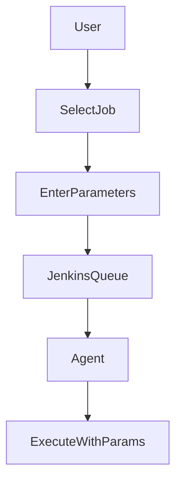
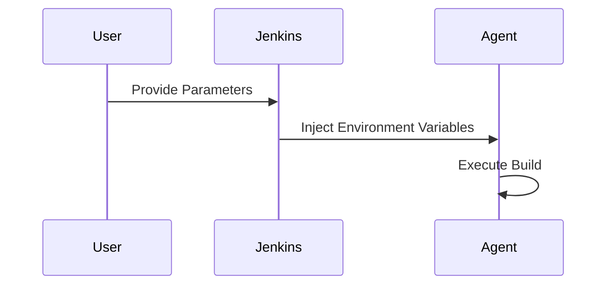

# Parameterized Builds in Jenkins

## Introduction

A **Parameterized Build** allows a Jenkins job to accept user-defined inputs at runtime.

Instead of hardcoding values like:

* Environment name
* Version number
* Branch
* Deployment target

You pass them dynamically when triggering the job.

This enables:

* Reusability
* Controlled deployments
* Environment-based builds
* Reduced job duplication

Parameterized builds are foundational for real-world CI/CD pipelines.

---

# Why Parameterization Matters

Without parameters:

* You create separate jobs for dev, staging, prod
* Configuration becomes duplicated
* Maintenance becomes error-prone

With parameters:

* One job handles multiple scenarios
* Deployment becomes controlled and auditable

---

# Parameterized Build Flow



Parameters are injected into the build environment.

---

# Enabling Parameterized Build (Freestyle)

## Step 1: Configure Job

1. Open job
2. Click **Configure**
3. Check **This project is parameterized**

---

## Step 2: Add Parameters

Common parameter types:

* String Parameter
* Choice Parameter
* Boolean Parameter
* Password Parameter
* File Parameter

---

# Common Parameter Types Explained

## 1. String Parameter

Used for:

* Version
* Branch
* Tag
* Custom message

Example:

* Name: `VERSION`
* Default: `1.0.0`

Access in shell:

```bash
echo "Building version ${VERSION}"
```

---

## 2. Choice Parameter

Used for:

* Environment selection
* Deployment target

Example:

* Name: `ENV`
* Choices:

  * dev
  * staging
  * prod

Access:

```bash
echo "Deploying to ${ENV}"
```

---

## 3. Boolean Parameter

Used for feature toggles.

Example:

* Name: `RUN_TESTS`
* Default: true

Access:

```bash
if [ "$RUN_TESTS" = "true" ]; then
    mvn test
fi
```

---

## 4. Password Parameter

Used for:

* Sensitive runtime input

Avoid this if possible. Use Jenkins Credentials instead.

---

# Example: Java Deployment Job

Parameters:

* ENV (choice)
* VERSION (string)

Build step:

```bash
mvn clean package -Drevision=${VERSION}

if [ "${ENV}" = "prod" ]; then
    echo "Deploying to production"
fi
```

Single job handles multi-environment deployment.

---

# Parameterized Pipeline Example

Declarative Pipeline:

```groovy
pipeline {
    agent any

    parameters {
        string(name: 'VERSION', defaultValue: '1.0.0', description: 'Build version')
        choice(name: 'ENV', choices: ['dev', 'staging', 'prod'], description: 'Deployment environment')
        booleanParam(name: 'RUN_TESTS', defaultValue: true, description: 'Run unit tests')
    }

    stages {
        stage('Build') {
            steps {
                sh "echo Building ${params.VERSION}"
                sh "mvn clean package -Drevision=${params.VERSION}"
            }
        }

        stage('Test') {
            when {
                expression { params.RUN_TESTS }
            }
            steps {
                sh 'mvn test'
            }
        }

        stage('Deploy') {
            steps {
                sh "echo Deploying to ${params.ENV}"
            }
        }
    }
}
```

Parameters become available via:

```
params.<PARAM_NAME>
```

---

# Advanced: Active Choice Parameters

Using **Active Choices Plugin**, parameters can:

* Dynamically populate based on other parameters
* Query APIs
* Adjust environment lists

Example scenario:

If ENV = prod, show only production servers.

---

# Parameter Injection Model



Parameters are injected as environment variables in Freestyle jobs.

---

# Common Mistakes

1. Using parameters for secrets instead of credentials
2. Not validating production deployments
3. Allowing anyone to trigger prod deployment
4. Hardcoding environment logic incorrectly
5. Creating too many parameters making job confusing

---

# Validation Strategy

In production pipelines:

* Validate environment selection
* Restrict prod deployment to authorized users
* Add approval steps before deployment

Example Pipeline approval:

```groovy
stage('Approval') {
    when {
        expression { params.ENV == 'prod' }
    }
    steps {
        input message: "Approve production deployment?"
    }
}
```

---

# Best Practices

* Keep parameter list minimal
* Use choice parameters for controlled values
* Avoid free-text environment names
* Never pass secrets as plain parameters
* Combine parameters with role-based access
* Document parameter purpose clearly
* Validate production actions

---

# Real-World Use Case

A team maintained three separate jobs:

* Deploy-dev
* Deploy-staging
* Deploy-prod

Each had duplicated logic.

Problems:

* Config drift
* Inconsistent version handling
* Hard to maintain

They replaced all three with:

* One parameterized pipeline
* ENV choice parameter
* VERSION string parameter
* Approval step for prod

Result:

* Reduced configuration complexity
* Unified deployment process
* Better audit tracking

---

# Pro-Tip

Parameterized builds convert Jenkins from a static executor into a dynamic deployment engine.

Use parameters to:

* Control environments
* Standardize deployments
* Enable safe production releases

Avoid parameter sprawl. Every parameter should represent a deliberate runtime decision, not a workaround for poor pipeline design.
