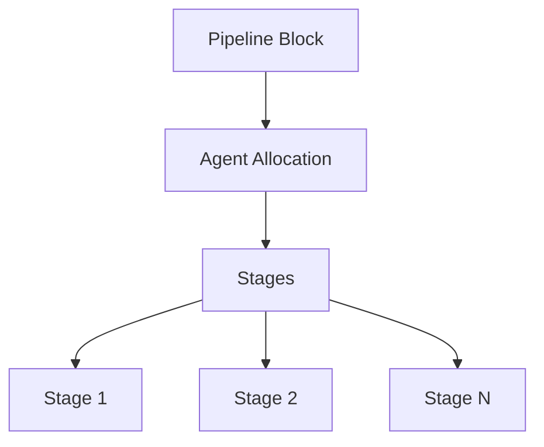
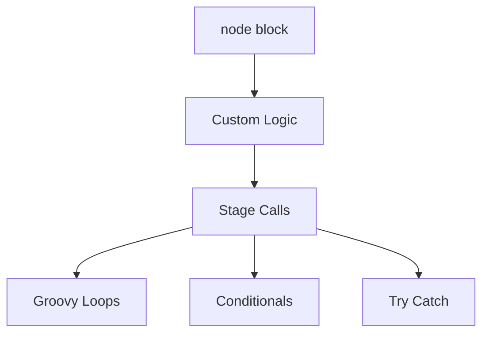

# Declarative vs Scripted Pipeline (Jenkins)

In Jenkins, pipelines can be written in two styles:

* **Declarative Pipeline**
* **Scripted Pipeline**

Both use Groovy-based DSL but differ in structure, flexibility, and control level.

---

# 1. High-Level Comparison

| Feature         | Declarative       | Scripted                |
| --------------- | ----------------- | ----------------------- |
| Syntax Style    | Structured        | Programmatic            |
| Complexity      | Simple            | Advanced                |
| Learning Curve  | Easier            | Steeper                 |
| Flexibility     | Limited but clean | Fully flexible          |
| Error Handling  | Built-in patterns | Manual control          |
| Recommended For | Standard CI/CD    | Complex logic workflows |

---

# 2. Structural Difference

## Declarative Structure

```groovy
pipeline {
    agent any

    stages {
        stage('Build') {
            steps {
                sh 'echo Building'
            }
        }
    }
}
```

### Characteristics

* Must start with `pipeline {}`
* Organized into predefined sections
* Opinionated structure
* Less room for arbitrary logic outside blocks

---

## Scripted Structure

```groovy
node {
    stage('Build') {
        sh 'echo Building'
    }
}
```

### Characteristics

* Starts with `node {}`
* Pure Groovy control
* Loops, conditionals, try/catch fully manual
* Maximum flexibility

---

# 3. Execution Model

## Declarative Execution Flow



Controlled and predictable.

---

## Scripted Execution Flow



Fully dynamic.

---

# 4. Error Handling

## Declarative

Built-in options:

```groovy
post {
    always { echo 'Cleanup' }
    success { echo 'Success' }
    failure { echo 'Failure' }
}
```

Structured lifecycle hooks.

---

## Scripted

Manual handling:

```groovy
node {
    try {
        sh 'make build'
    } catch (err) {
        echo "Failed"
    } finally {
        echo "Cleanup"
    }
}
```

Full Groovy control.

---

# 5. Conditional Logic

## Declarative

```groovy
when {
    branch 'main'
}
```

Limited but readable.

---

## Scripted

```groovy
if (env.BRANCH_NAME == 'main') {
    sh 'deploy.sh'
}
```

Unlimited flexibility.

---

# 6. Parallel Execution

## Declarative

```groovy
stage('Parallel') {
    parallel {
        stage('Test1') {
            steps { sh 'echo test1' }
        }
        stage('Test2') {
            steps { sh 'echo test2' }
        }
    }
}
```

---

## Scripted

```groovy
parallel(
    "Test1": { sh 'echo test1' },
    "Test2": { sh 'echo test2' }
)
```

Scripted allows dynamic generation of parallel branches.

---

# 7. Maintainability Perspective

## Declarative

* Cleaner structure
* Easier for teams
* Better visualization in UI
* Safer guardrails

## Scripted

* Better for complex automation
* Supports dynamic stage generation
* Harder to maintain in large teams

---

# 8. Internal Processing Concept

Both pipelines are interpreted by:

* Groovy engine
* Jenkins Pipeline CPS (Continuation Passing Style) engine
* Execution on agents

Architecture view:


---

# 9. When to Use What

### Use Declarative When:

* Standard CI/CD
* Microservices pipelines
* Team-based development
* You want consistency

### Use Scripted When:

* Complex decision trees
* Dynamic stage creation
* Custom orchestration logic
* Advanced Groovy scripting required

---

# 10. Practical Industry Approach

Most teams:

* Use Declarative as default
* Embed `script {}` block inside Declarative for complex logic

Example:

```groovy
stage('Dynamic Logic') {
    steps {
        script {
            for (i in 1..3) {
                echo "Iteration ${i}"
            }
        }
    }
}
```

Hybrid model gives structure + flexibility.

---

# 11. Mental Model

Declarative = Structured framework
Scripted = Full programming control

Declarative enforces order.
Scripted gives power.
