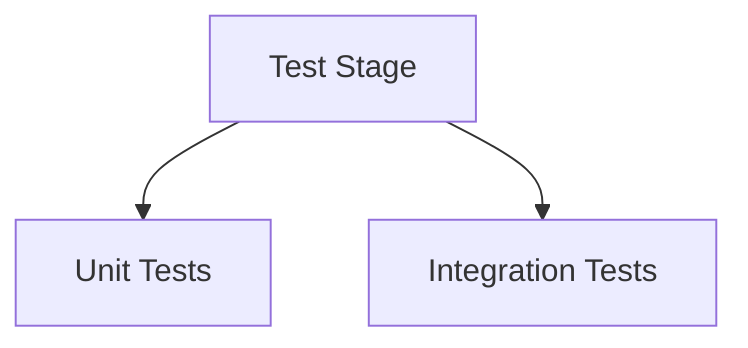

# Jenkinsfile Best Practices

Applies to pipelines executed in Jenkins using a `Jenkinsfile`.

---

# 1. Always Store Jenkinsfile in Version Control

Keep the `Jenkinsfile` inside the same repository as the application code.

```
project-root/
 ├── src/
 ├── Dockerfile
 └── Jenkinsfile
```

Reason:

* Pipeline versioned with code
* Rollback aligned with commit history
* No UI-only configuration drift

---

# 2. Prefer Declarative Pipeline

Use Declarative unless strong dynamic logic is required.

Why:

* Predictable structure
* Built-in lifecycle blocks
* Easier onboarding
* Cleaner UI visualization

---

# 3. Keep Jenkinsfile Thin

Avoid large business logic inside the pipeline.

Bad:

```groovy
script {
    // 200 lines of logic
}
```

Good:

```groovy
sh './scripts/build.sh'
```

Move logic to:

* Shell scripts
* Makefiles
* Gradle/Maven configs
* Shared libraries

Pipeline orchestrates. Code executes.

---

# 4. Use Stages Clearly

Each stage should represent one logical step.

Example:


Clear stage names improve traceability.

---

# 5. Use Agent Strategically

Avoid running everything on one node.

Bad:

```groovy
agent any
```

Better:

```groovy
stage('Build') {
    agent { label 'linux' }
}
```

Benefits:

* Resource isolation
* Faster builds
* Better scaling

---

# 6. Use Environment Block

Centralize environment variables.

```groovy
environment {
    APP_NAME = "payment-service"
    DOCKER_REGISTRY = "registry.example.com"
}
```

Avoid hardcoding values inside steps.

---

# 7. Use Credentials Securely

Never hardcode secrets.

Use credentials binding:

```groovy
withCredentials([string(credentialsId: 'api-key', variable: 'API_KEY')]) {
    sh 'curl -H "Authorization: $API_KEY" ...'
}
```

Secrets stay encrypted in Jenkins.

---

# 8. Use Post Conditions

Handle success, failure, cleanup.

```groovy
post {
    success {
        echo "Build succeeded"
    }
    failure {
        echo "Build failed"
    }
    always {
        cleanWs()
    }
}
```

Lifecycle handling prevents resource leaks.

---

# 9. Fail Fast

Stop early when critical stage fails.

```groovy
options {
    skipStagesAfterUnstable()
}
```

In parallel:

```groovy
failFast true
```

Reduces wasted compute time.

---

# 10. Use Timeouts

Avoid hung builds.

```groovy
options {
    timeout(time: 30, unit: 'MINUTES')
}
```

Prevents executor starvation.

---

# 11. Use Parallel for Independent Tasks

Example:

```groovy
stage('Test') {
    parallel {
        stage('Unit Tests') {
            steps { sh 'npm test' }
        }
        stage('Integration Tests') {
            steps { sh 'npm run integration' }
        }
    }
}
```

Architecture:



Improves pipeline speed.

---

# 12. Avoid Large Script Blocks

Use `script {}` only when necessary.

Declarative should remain structured.

---

# 13. Archive Artifacts Properly

```groovy
archiveArtifacts artifacts: 'build/*.jar', fingerprint: true
```

Enables:

* Traceability
* Build reproducibility
* Deployment audits

---

# 14. Use Shared Libraries

For reusable logic across projects.

Structure:


Benefits:

* Standardization
* DRY principle
* Centralized updates

---

# 15. Clean Workspace

Avoid disk buildup.

```groovy
post {
    always {
        cleanWs()
    }
}
```

Prevents storage exhaustion.

---

# 16. Keep Build Deterministic

Avoid:

* Using "latest" Docker tags
* Pulling floating dependencies
* Random artifact names

Pin versions explicitly.

---

# 17. Separate CI and CD When Needed

Option A: Single pipeline

Option B: Multi-pipeline architecture


Improves security and release control.

---

# 18. Use Branch-Based Logic Properly

```groovy
when {
    branch 'main'
}
```

Avoid complex nested branch checks.

---

# 19. Enable Build Retention

Prevent storage growth:

```groovy
options {
    buildDiscarder(logRotator(numToKeepStr: '20'))
}
```

---

# 20. Observability and Notifications

Integrate:

* Slack
* Email
* Monitoring systems

Failures must be visible immediately.

---

# 21. Ideal Production Flow


Structured. Observable. Controlled.

---

# Core Principle

Jenkinsfile should:

* Orchestrate
* Remain readable
* Be reproducible
* Avoid hidden logic
* Enforce deterministic builds

Pipeline is infrastructure code. Treat it with the same discipline as production software.
