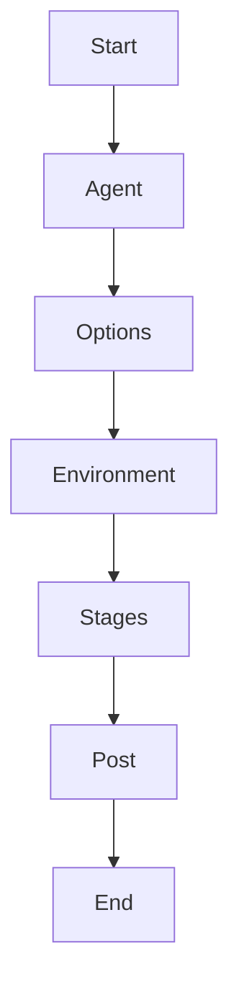

# Jenkins Pipeline Syntax and Directives

## Introduction

Jenkins Pipeline allows defining CI/CD workflows as code using a **Jenkinsfile**. There are two major styles:

* Declarative Pipeline
* Scripted Pipeline

This document focuses on **Declarative Pipeline syntax and directives**, as it is recommended for most production environments due to readability, structure, and guardrails.

Understanding directives is essential for building maintainable pipelines.

---

# Declarative Pipeline Structure

A Declarative Pipeline follows a strict structure:

```groovy
pipeline {
    agent any
    options { }
    environment { }
    parameters { }
    triggers { }
    stages {
        stage('Stage Name') {
            steps {
                // steps go here
            }
        }
    }
    post { }
}
```

Each block is called a **directive**.

---

# Pipeline Execution Flow



Execution follows a defined lifecycle.

---

# Core Directives Explained

## 1. pipeline

Root block. Mandatory.

```groovy
pipeline {
    ...
}
```

Defines the entire workflow.

---

## 2. agent

Specifies where the pipeline runs.

Examples:

Run anywhere:

```groovy
agent any
```

Run on specific labeled node:

```groovy
agent {
    label 'docker-node'
}
```

Run inside Docker:

```groovy
agent {
    docker {
        image 'maven:3.9.6-eclipse-temurin-17'
    }
}
```

Best practice: Avoid running heavy workloads on controller.

---

## 3. stages

Contains ordered execution blocks.

```groovy
stages {
    stage('Build') {
        steps {
            sh 'mvn clean package'
        }
    }
}
```

Each stage represents a logical step.

---

## 4. stage

Defines a unit of work.

```groovy
stage('Test') {
    steps {
        sh 'mvn test'
    }
}
```

Stages provide:

* Visualization
* Parallelization
* Logical grouping

---

## 5. steps

Actual commands executed inside a stage.

Common steps:

* sh
* bat
* git
* echo
* script

Example:

```groovy
steps {
    sh 'npm install'
}
```

---

# Environment Directive

Defines environment variables.

```groovy
environment {
    APP_NAME = "inventory-service"
    VERSION = "1.0.0"
}
```

Access:

```groovy
sh "echo ${APP_NAME}"
```

Useful for global configuration.

---

# Parameters Directive

Defines runtime inputs.

```groovy
parameters {
    string(name: 'VERSION', defaultValue: '1.0.0')
    choice(name: 'ENV', choices: ['dev', 'staging', 'prod'])
}
```

Access via:

```
params.VERSION
```

---

# Options Directive

Controls pipeline behavior.

Common options:

```groovy
options {
    buildDiscarder(logRotator(numToKeepStr: '10'))
    timeout(time: 30, unit: 'MINUTES')
    disableConcurrentBuilds()
}
```

Use cases:

* Prevent concurrent runs
* Set timeout
* Clean old builds

---

# Triggers Directive

Define automatic execution.

```groovy
triggers {
    cron('H 2 * * *')
}
```

Or:

```groovy
triggers {
    pollSCM('H/10 * * * *')
}
```

Webhooks are configured outside Jenkinsfile.

---

# When Directive

Conditional stage execution.

Example:

```groovy
stage('Deploy') {
    when {
        branch 'main'
    }
    steps {
        sh './deploy.sh'
    }
}
```

Expression-based condition:

```groovy
when {
    expression { params.ENV == 'prod' }
}
```

---

# Parallel Directive

Run stages concurrently.

```groovy
stage('Tests') {
    parallel {
        stage('Unit Tests') {
            steps {
                sh 'mvn test'
            }
        }
        stage('Lint') {
            steps {
                sh 'mvn checkstyle:check'
            }
        }
    }
}
```

Parallelization reduces build time.

---

# Post Directive

Defines actions after pipeline completion.

```groovy
post {
    always {
        echo 'Pipeline finished'
    }
    success {
        echo 'Build successful'
    }
    failure {
        echo 'Build failed'
    }
}
```

Common use:

* Notifications
* Cleanup
* Artifact archiving

---

# Complete Declarative Example

```groovy
pipeline {
    agent any

    environment {
        APP = "demo"
    }

    options {
        timeout(time: 20, unit: 'MINUTES')
        disableConcurrentBuilds()
    }

    parameters {
        choice(name: 'ENV', choices: ['dev', 'prod'])
    }

    stages {
        stage('Checkout') {
            steps {
                git 'https://github.com/example/app.git'
            }
        }

        stage('Build') {
            steps {
                sh 'mvn clean package'
            }
        }

        stage('Deploy') {
            when {
                expression { params.ENV == 'prod' }
            }
            steps {
                sh './deploy.sh'
            }
        }
    }

    post {
        failure {
            echo 'Investigate failure'
        }
    }
}
```

---

# Declarative vs Scripted Syntax Structure

| Aspect          | Declarative    | Scripted          |
| --------------- | -------------- | ----------------- |
| Structure       | Strict         | Flexible          |
| Learning Curve  | Easier         | Steeper           |
| Readability     | High           | Medium            |
| Advanced Logic  | Limited        | Full Groovy       |
| Recommended For | Most pipelines | Complex workflows |

Declarative internally compiles to Scripted.

---

# Common Syntax Errors

## Missing agent

Pipeline fails validation.

Fix:

```groovy
agent any
```

---

## Improper Block Nesting

Wrong:

```groovy
stage('Build')
steps {
    sh 'mvn clean'
}
```

Correct:

```groovy
stage('Build') {
    steps {
        sh 'mvn clean'
    }
}
```

---

## Using params Without Definition

Ensure parameters block exists.

---

# Best Practices

* Keep stages logical and small
* Avoid deeply nested script blocks
* Use declarative syntax unless necessary
* Define timeouts
* Disable concurrent builds when deploying
* Separate build and deploy stages
* Use post for cleanup and notifications

---

# Real-World Use Case

A team had long monolithic pipeline:

* Single stage
* 400 lines of shell
* No logical separation

Problems:

* Hard to debug
* No visibility
* Frequent failures

Refactored to:

* Separate stages
* Use parallel tests
* Use when for controlled deploy
* Add post failure notifications

Result:

* Faster builds
* Clear stage-level failures
* Improved team collaboration

---

# Pro-Tip

Declarative syntax enforces discipline.

Use directives intentionally:

* agent controls compute
* options control stability
* environment controls configuration
* when controls deployment safety
* post controls lifecycle cleanup

Pipeline readability is a long-term operational advantage.
