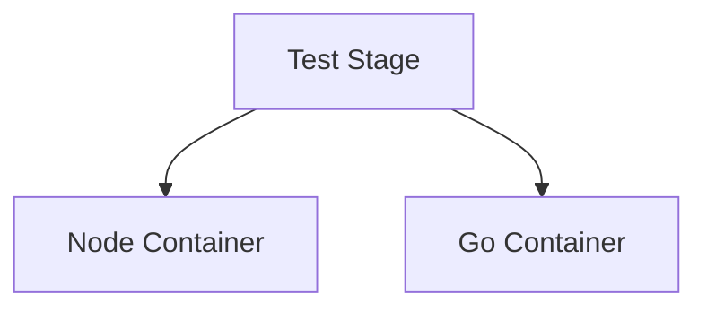

# Docker Agents in Jenkins

Docker agents allow builds to run inside **containerized environments** instead of directly on the host machine. This ensures consistency, portability, and clean isolation between builds.

In Jenkins, Docker agents are commonly used to:

* Standardize build environments
* Avoid dependency conflicts
* Enable reproducible pipelines
* Improve scalability

---

# 1. Why Use Docker Agents

Traditional Jenkins nodes suffer from:

* Dependency drift
* Version mismatches
* Manual package installations
* Shared environment conflicts

Docker solves this by running each build inside an isolated container.

### Execution Model


Each pipeline execution can spin up a fresh container and destroy it afterward.

---

# 2. Types of Docker Usage in Jenkins

| Type                    | Description                       | Use Case                 |
| ----------------------- | --------------------------------- | ------------------------ |
| Docker Agent (Pipeline) | Container per stage or pipeline   | Most common modern usage |
| Docker Cloud Agents     | Auto-provision agents dynamically | Large-scale CI           |
| Docker-in-Docker        | Container running Docker daemon   | Complex build workflows  |
| Static Docker Node      | Dedicated Docker-based node       | Controlled environments  |

---

# 3. Using Docker Agent in Declarative Pipeline

## Basic Example

```groovy
pipeline {
    agent {
        docker {
            image 'maven:3.9.6-eclipse-temurin-17'
        }
    }

    stages {
        stage('Build') {
            steps {
                sh 'mvn clean package'
            }
        }
    }
}
```

Flow:


---

# 4. Using Docker Per Stage

Useful when different stages require different environments.

```groovy
pipeline {
    agent none

    stages {
        stage('Build') {
            agent {
                docker {
                    image 'node:20'
                }
            }
            steps {
                sh 'npm install'
            }
        }

        stage('Test') {
            agent {
                docker {
                    image 'python:3.11'
                }
            }
            steps {
                sh 'pytest'
            }
        }
    }
}
```

Benefits:

* Language isolation
* Clean dependency boundaries
* Flexible architecture

---

# 5. Using Custom Dockerfile

Instead of pulling public images, build from your own Dockerfile.

```groovy
pipeline {
    agent {
        dockerfile {
            filename 'Dockerfile.ci'
        }
    }

    stages {
        stage('Build') {
            steps {
                sh 'make build'
            }
        }
    }
}
```

Jenkins builds the image before execution.

---

# 6. Mounting Volumes

Useful for caching dependencies.

```groovy
agent {
    docker {
        image 'maven:3.9.6-eclipse-temurin-17'
        args '-v /root/.m2:/root/.m2'
    }
}
```

Reduces build time by reusing Maven cache.

---

# 7. Using Docker Registry Credentials

For private images:

```groovy
agent {
    docker {
        image 'private.registry.com/app-ci:1.0'
        registryUrl 'https://private.registry.com'
        registryCredentialsId 'docker-creds'
    }
}
```

Credentials must be configured in Jenkins securely.

---

# 8. Docker Agents with Parallel Stages

```groovy
stage('Test') {
    parallel {
        stage('Unit Tests') {
            agent {
                docker { image 'node:20' }
            }
            steps {
                sh 'npm test'
            }
        }
        stage('Integration Tests') {
            agent {
                docker { image 'golang:1.22' }
            }
            steps {
                sh 'go test ./...'
            }
        }
    }
}
```

Architecture:



Each runs independently.

---

# 9. Docker Cloud Agents (Dynamic Scaling)

In large environments:

* Jenkins connects to Docker host
* Containers provisioned dynamically
* Destroyed after build

Architecture:


This improves scalability significantly.

---

# 10. Best Practices

## 1. Use Specific Image Tags

Avoid:

```
node:latest
```

Use:

```
node:20.11.1
```

Prevents unexpected breakage.

---

## 2. Keep Containers Ephemeral

Do not rely on container state between builds.

---

## 3. Separate Build and Runtime Images

Build image:

* Includes compilers and tools

Runtime image:

* Minimal
* Only required binaries

---

## 4. Use Multi-Stage Docker Builds

Optimizes image size.

---

## 5. Monitor Disk Usage

Docker images accumulate quickly on Jenkins hosts.

Clean regularly:

```
docker system prune -f
```

---

# Troubleshooting

## 1. "Docker not found"

Cause:

* Docker not installed on agent node
* Jenkins user not in docker group

Fix:

```
sudo usermod -aG docker jenkins
```

Restart Jenkins service.

---

## 2. Permission Denied on Workspace

Ensure workspace directory ownership aligns with container user.

Option:

* Run container with specific UID
* Adjust file permissions

---

## 3. Slow Image Pulls

Solutions:

* Use local registry mirror
* Pre-pull common images
* Use caching volumes

---

# Real-World Use Case

Scenario:
Enterprise microservices architecture.

Each service:

* Different language
* Different build requirements

Solution:

* Use Docker agent per stage
* Shared base CI images
* Parallel test execution

Result:

* Consistent builds
* Faster pipelines
* Reduced infrastructure conflicts
* Easy onboarding for new developers

---

# Industry Pattern

Modern CI/CD systems almost always use containerized agents. Bare-metal agents are rare in production-grade DevOps environments.

Docker agents provide:

* Deterministic builds
* Isolation
* Portability
* Horizontal scalability

Containerized CI is no longer optional. It is baseline engineering practice.
