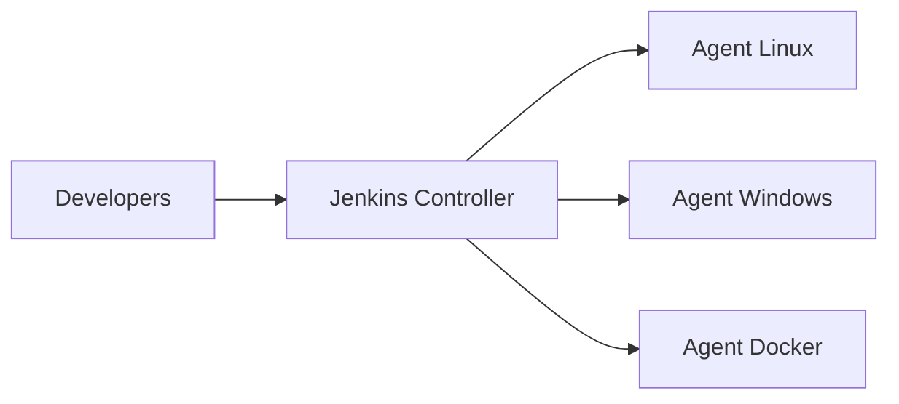
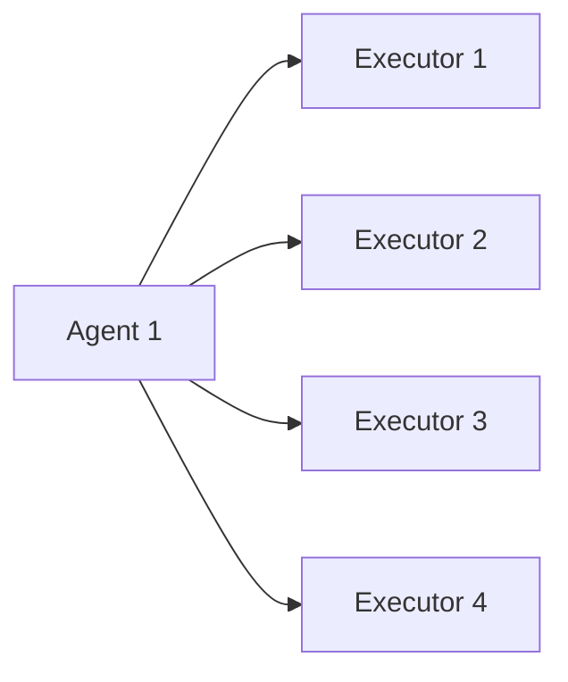
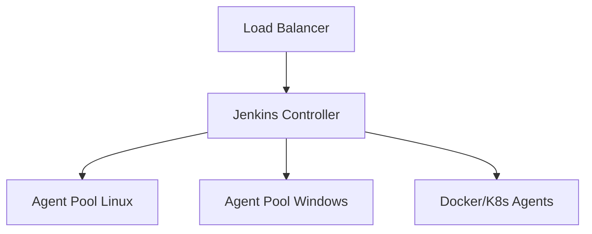
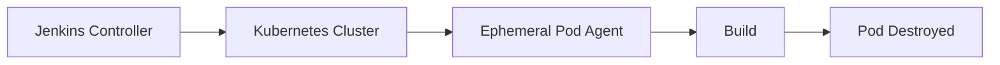

# Master-Agent Architecture in Jenkins

The **Master-Agent architecture** (now commonly referred to as **Controller-Agent**) is the foundational distributed build model in Jenkins.

It separates orchestration from execution.

* **Controller (Master)** → Manages jobs, UI, plugins, scheduling.
* **Agents (Workers/Nodes)** → Execute build tasks.

This model enables scalability, isolation, and resource optimization.

---

# 1. Why Distributed Builds Are Required

Single-node Jenkins environments fail at scale because:

* CPU and memory become bottlenecks
* Builds block each other
* Different toolchains conflict
* Security boundaries blur

Distributed architecture solves these by delegating work.

---

# 2. Core Components

## 1. Controller (Master)

Responsibilities:

* Web UI
* Job configuration
* Build scheduling
* Plugin management
* Credentials storage
* Pipeline orchestration

The controller should **not run builds in production**.

---

## 2. Agent (Node)

Responsibilities:

* Execute build steps
* Run shell commands
* Compile code
* Build Docker images
* Run tests

Agents can be:

* Physical machines
* Virtual machines
* Containers
* Kubernetes pods

---

# 3. Architecture Overview



Flow:

1. Developer triggers build.
2. Controller schedules job.
3. Controller assigns job to suitable agent.
4. Agent executes build.
5. Results return to controller.

---

# 4. Communication Model

Agents connect to controller using:

* **SSH**
* **JNLP (Java Web Start / inbound agents)**
* **Kubernetes plugin**
* **Cloud plugins**

Communication is encrypted.

---

# 5. Task Assignment Logic

When a pipeline runs:

```groovy
agent { label 'linux' }
```

Jenkins:

1. Searches agents with label `linux`
2. Checks availability
3. Allocates executor
4. Dispatches build

---

# 6. Executors Concept

Each agent has **executors**.

* 1 executor = 1 concurrent build slot
* If 4 executors → 4 parallel builds

Example:



Misconfiguration causes resource exhaustion.

---

# 7. Static vs Dynamic Agents

| Type              | Description                 | When to Use        |
| ----------------- | --------------------------- | ------------------ |
| Static Agents     | Permanently connected nodes | Small environments |
| Ephemeral Agents  | Created per build           | Cloud-native CI    |
| Docker Agents     | Container-based             | Isolation needed   |
| Kubernetes Agents | Pod-based scaling           | Enterprise scale   |

Modern systems prefer ephemeral agents.

---

# 8. Security Considerations

Controller stores:

* Credentials
* Secrets
* Job configurations

Never:

* Expose controller publicly without protection
* Run untrusted builds on controller
* Allow root-level access casually

Best practice:

* Controller isolated in private network
* Agents in separate subnet
* Least privilege model

---

# 9. Recommended Production Layout



Controller:

* Minimal resources
* No heavy builds

Agents:

* Auto-scaled
* Tool-specific
* Environment-isolated

---

# 10. Labeling Strategy

Use labels for intelligent routing.

Examples:

* `linux`
* `windows`
* `docker`
* `high-memory`
* `gpu`

Example:

```groovy
agent { label 'high-memory' }
```

Prevents misallocation.

---

# 11. Failure Scenarios

## Agent Offline

Symptoms:

* Build stuck in queue
* "No nodes available" message

Causes:

* Network issue
* SSH failure
* Agent service stopped

---

## Executor Starvation

Symptoms:

* Long build queue

Cause:

* Too few executors
* Heavy builds blocking

---

## Controller Overload

Symptoms:

* UI slow
* Pipeline delays

Cause:

* Running builds on controller
* Too many plugins

---

# 12. Real-World Use Case

Scenario:
Enterprise running:

* Java services
* .NET applications
* Node.js frontends
* Docker builds

Solution:

* Linux agent pool for Java/Node
* Windows agents for .NET
* Dedicated Docker agents
* High-memory agents for integration tests

Outcome:

* Parallel execution
* Toolchain isolation
* Reduced build failures
* Predictable scaling

---

# 13. Industry Evolution

Original model: Single master, static agents.

Modern pattern:



Build environments are created per execution and destroyed afterward.

This eliminates:

* Dependency drift
* Security risks
* Long-term maintenance

---

# Best Practices Summary

* Never run production builds on controller
* Keep controller lightweight
* Use labels effectively
* Prefer ephemeral agents
* Limit executor counts based on CPU cores
* Monitor agent health
* Separate workloads by environment

Distributed architecture is mandatory beyond small teams. Without it, Jenkins becomes unstable, slow, and operationally expensive.
