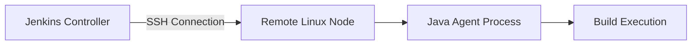
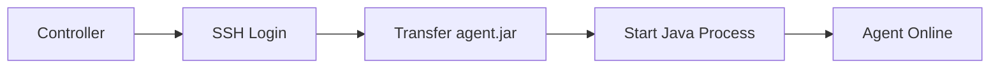
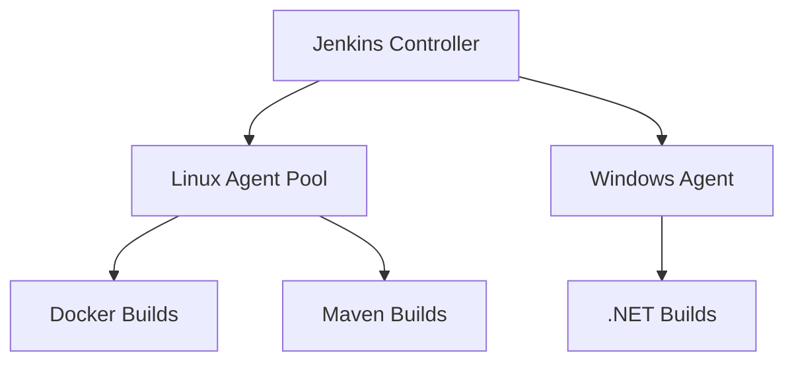

# Setting Up SSH Nodes in Jenkins

SSH-based agents are one of the most stable and widely used ways to connect remote build machines to Jenkins.

This method allows the Jenkins controller to securely connect to a remote machine over **SSH**, start the agent process, and execute builds remotely.

---

# 1. When to Use SSH Nodes

Use SSH agents when:

* You manage your own Linux servers
* You want persistent build machines
* You require controlled infrastructure
* Cloud auto-scaling is not required

Not ideal for highly elastic CI systems. Better suited for stable infrastructure.

---

# 2. Architecture Overview



Flow:

1. Controller connects via SSH.
2. Jenkins uploads agent JAR.
3. Agent process starts.
4. Builds execute on remote machine.

---

# 3. Prerequisites on Remote Node

Remote machine must have:

* Linux OS (recommended)
* **Java 11+ installed**
* SSH server running
* Sufficient disk and CPU
* Proper user permissions

Verify Java:

```bash
java -version
```

Install Java if missing:

```bash
sudo apt update
sudo apt install openjdk-17-jdk -y
```

---

# 4. Create a Dedicated Jenkins User (Recommended)

Avoid using root.

```bash
sudo adduser jenkins
sudo usermod -aG sudo jenkins
```

Allow SSH access:

```bash
sudo nano /etc/ssh/sshd_config
```

Ensure:

```
PasswordAuthentication yes
```

Restart SSH:

```bash
sudo systemctl restart ssh
```

---

# 5. Configure SSH Key Authentication (Best Practice)

On Jenkins controller:

```bash
ssh-keygen -t rsa -b 4096
```

Copy public key to remote node:

```bash
ssh-copy-id jenkins@remote-ip
```

Test:

```bash
ssh jenkins@remote-ip
```

Passwordless login must work.

---

# 6. Configure SSH Node in Jenkins UI

Steps:

1. Navigate to **Manage Jenkins**
2. Select **Nodes**
3. Click **New Node**
4. Enter:

   * Name: `linux-agent-1`
   * Type: Permanent Agent

---

## Node Configuration Fields

### Remote Root Directory

Example:

```
/home/jenkins
```

### Labels

Example:

```
linux docker high-memory
```

### Launch Method

Select:

**Launch agents via SSH**

---

## SSH Configuration

* Host: `remote-ip`
* Credentials:

  * Add → SSH Username with Private Key
* Host Key Verification:

  * Non-verifying (for lab)
  * Known hosts file (for production)

Click Save.

---

# 7. Connection Process

When saving:



If successful, node status becomes **Connected**.

---

# 8. Test the Node

Create pipeline:

```groovy
pipeline {
    agent { label 'linux' }

    stages {
        stage('Test') {
            steps {
                sh 'hostname'
                sh 'whoami'
            }
        }
    }
}
```

Build logs should show remote machine hostname.

---

# 9. Executor Configuration

Set number of executors based on CPU cores.

Example:

* 4 CPU cores → 2 executors recommended
* Avoid overcommitting

Rule:

Executors <= (CPU cores - 1)

---

# 10. Common Issues

## 1. Connection Refused

Cause:

* SSH not running
* Firewall blocking port 22

Fix:

```bash
sudo systemctl status ssh
sudo ufw allow 22
```

---

## 2. Authentication Failure

Cause:

* Wrong credentials
* Missing SSH key

Fix:

* Reconfigure credentials
* Re-copy public key

---

## 3. Java Not Found

Error:

```
java: command not found
```

Install Java properly.

---

## 4. Permission Denied on Workspace

Ensure remote root directory owned by Jenkins user:

```bash
sudo chown -R jenkins:jenkins /home/jenkins
```

---

# 11. Security Best Practices

* Use SSH key authentication only
* Disable password login in production
* Use non-root user
* Restrict agent access to internal network
* Use firewall rules
* Rotate SSH keys periodically

---

# 12. Production Architecture Example



Separation by workload improves stability.

---

# 13. Real-World Use Case

Scenario:
Mid-size company with 15 developers.

Infrastructure:

* 1 Jenkins controller VM
* 3 Linux build servers

Implementation:

* SSH agents configured per server
* Label-based routing
* Dedicated agent for Docker builds
* One high-memory agent for integration testing

Result:

* Parallel builds
* Stable environment
* Reduced queue time
* Clear workload separation

---

# When SSH Nodes Are Not Ideal

Avoid SSH nodes when:

* Auto-scaling is required
* Cloud-native architecture exists
* Infrastructure is highly dynamic

In those cases, Kubernetes or Docker cloud agents are superior.

---

# Core Takeaway

SSH nodes are:

* Stable
* Easy to configure
* Suitable for traditional infrastructure
* Reliable for medium-scale CI

They remain widely used in enterprise environments where infrastructure control is required.
