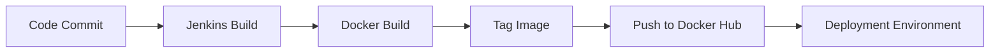
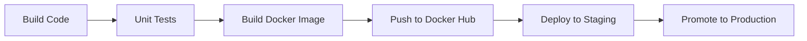
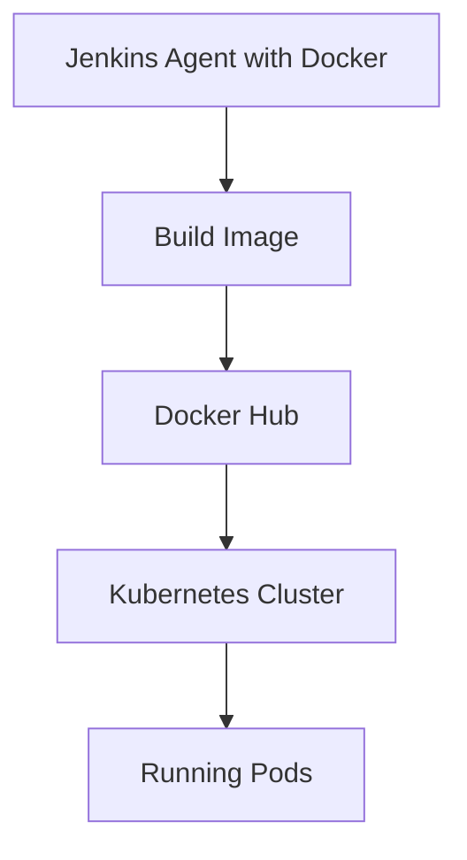

# Docker Hub Integration with Jenkins

Integrating **Docker Hub** with Jenkins allows automated image building and pushing as part of CI/CD pipelines.

This enables:

* Automated container image creation
* Versioned image tagging
* Centralized image storage
* Deployment-ready artifacts

---

# 1. Why Integrate Docker Hub

Modern applications are containerized. After building code, the next step is to:

1. Build Docker image
2. Tag appropriately
3. Push to registry
4. Deploy from registry

Docker Hub acts as the image registry.

---

# 2. High-Level Flow



---

# 3. Prerequisites

Ensure:

* Docker installed on Jenkins agent
* Docker service running
* Docker Hub account created
* Jenkins has Docker plugin (optional but recommended)

Verify Docker:

```bash
docker --version
```

---

# 4. Store Docker Hub Credentials in Jenkins

Never hardcode credentials.

### Steps:

1. Go to **Manage Jenkins**
2. Select **Credentials**
3. Add:

   * Kind: Username with password
   * Username: Docker Hub username
   * Password: Docker Hub access token
   * ID: `docker-hub-creds`

Use Docker Hub access token instead of password.

---

# 5. Basic Pipeline Example

## Declarative Pipeline

```groovy
pipeline {
    agent { label 'docker' }

    environment {
        IMAGE_NAME = "yourdockerhubuser/my-app"
        IMAGE_TAG  = "${BUILD_NUMBER}"
    }

    stages {
        stage('Checkout') {
            steps {
                checkout scm
            }
        }

        stage('Build Image') {
            steps {
                sh "docker build -t $IMAGE_NAME:$IMAGE_TAG ."
            }
        }

        stage('Push Image') {
            steps {
                withCredentials([usernamePassword(
                    credentialsId: 'docker-hub-creds',
                    usernameVariable: 'DOCKER_USER',
                    passwordVariable: 'DOCKER_PASS'
                )]) {
                    sh """
                        echo $DOCKER_PASS | docker login -u $DOCKER_USER --password-stdin
                        docker push $IMAGE_NAME:$IMAGE_TAG
                    """
                }
            }
        }
    }
}
```

---

# 6. Tagging Strategy

Avoid pushing only `latest`.

Recommended pattern:

```
my-app:1
my-app:1.0
my-app:1.0.5
my-app:build-124
```

Example:

```groovy
IMAGE_TAG = "${env.BUILD_NUMBER}"
```

For Git-based versioning:

```groovy
IMAGE_TAG = sh(script: "git rev-parse --short HEAD", returnStdout: true).trim()
```

---

# 7. Using Docker Pipeline Plugin

If using Docker plugin:

```groovy
pipeline {
    agent any
    stages {
        stage('Build & Push') {
            steps {
                script {
                    def app = docker.build("yourdockerhubuser/my-app:${env.BUILD_NUMBER}")
                    docker.withRegistry('', 'docker-hub-creds') {
                        app.push()
                    }
                }
            }
        }
    }
}
```

Cleaner and more structured.

---

# 8. Multi-Stage CI/CD Pattern



Image becomes the deployment artifact.

---

# 9. Automatic Build Trigger via Webhook

Docker Hub can trigger Jenkins when:

* New image pushed
* Automated build completed

Alternative: Git push triggers Jenkins → Jenkins builds image → Pushes to Docker Hub.

Preferred model: Git-driven CI.

---

# 10. Secure Production Pattern

Avoid:

```
docker login
```

in plain shell without credential binding.

Better:

```groovy
withCredentials(...)
```

Even better:

* Use access tokens
* Rotate tokens
* Restrict repository scope

---

# 11. Cleanup After Push

Prevent disk overflow:

```groovy
sh "docker rmi $IMAGE_NAME:$IMAGE_TAG || true"
```

Or periodically:

```bash
docker system prune -f
```

---

# 12. Common Issues

## 1. "permission denied"

Cause:

* Docker user not in docker group

Fix:

```bash
sudo usermod -aG docker jenkins
```

Restart service.

---

## 2. "denied: requested access to the resource is denied"

Cause:

* Wrong repository name
* Missing namespace
* Invalid credentials

Ensure image name format:

```
dockerhubusername/repository
```

---

## 3. Slow Push

Cause:

* Large image layers

Fix:

* Use multi-stage builds
* Use slim base images
* Reduce unnecessary files

---

# 13. Production Architecture Example



CI produces immutable container images.
CD pulls versioned images.

---

# Real-World Use Case

Scenario:
Microservices architecture with 20 services.

Pipeline strategy:

* Each repo builds its own Docker image
* Tagged with commit SHA
* Pushed to Docker Hub
* ArgoCD or Kubernetes pulls image automatically

Outcome:

* Immutable deployments
* Rollback using image tags
* Environment parity across dev/stage/prod
* Faster scaling

---

# Best Practices Summary

* Use access tokens
* Never push only `latest`
* Tag images deterministically
* Clean local images after build
* Separate build image from runtime image
* Use multi-stage Docker builds
* Secure credentials via Jenkins

Docker Hub integration transforms Jenkins from a build server into a container artifact factory. Container images become the single deployable unit across environments.
