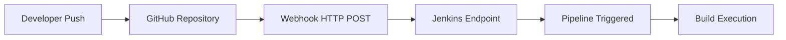
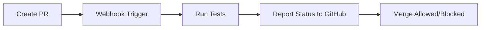
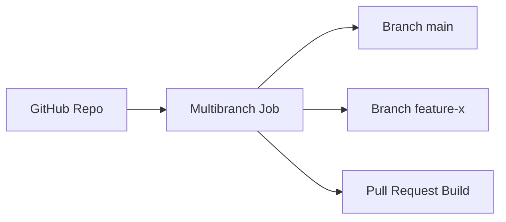
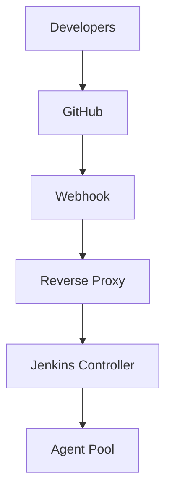

# Git and GitHub Webhooks Integration

Integrating Git repositories and webhooks with Jenkins enables automatic builds on every code change.

This eliminates manual triggering and establishes true Continuous Integration.

---

# 1. Why Webhooks Matter

Without webhooks:

* Developers must click “Build Now”
* CI is reactive and manual
* Feedback is delayed

With webhooks:

* Code push triggers build instantly
* Pull requests can trigger validation pipelines
* Faster feedback cycle

---

# 2. CI Flow with GitHub Webhook

Using GitHub:



---

# 3. Prerequisites

Ensure:

* Jenkins accessible via public IP or reverse proxy
* Proper DNS configured
* Git plugin installed
* GitHub integration plugin installed

Jenkins must be reachable from GitHub.

---

# 4. Configure Jenkins Job for Git

## In Pipeline Job

### Under Source Code Management:

* Choose **Git**
* Repository URL:

  ```
  https://github.com/username/repo.git
  ```
* Credentials (if private repo)

---

# 5. Enable Webhook Trigger in Jenkins

In Job Configuration:

Check:

**GitHub hook trigger for GITScm polling**

This allows Jenkins to react to webhook events.

---

# 6. Configure Webhook in GitHub

Steps in GitHub repository:

1. Go to **Settings**
2. Select **Webhooks**
3. Click **Add Webhook**

---

## Webhook Settings

**Payload URL**

```
http://your-jenkins-url/github-webhook/
```

Important: Trailing slash required.

**Content Type**

```
application/json
```

**Events**

Select:

* Just the push event
* Pull requests (optional)

Save webhook.

---

# 7. Verify Webhook Delivery

GitHub provides:

* Delivery logs
* Response status

Expected response:

```
HTTP 200
```

If failing:

* Check firewall
* Check reverse proxy config
* Validate Jenkins URL

---

# 8. Secure Webhook with Secret

In GitHub webhook settings:

Add a secret token.

In Jenkins:

Manage Jenkins → Configure System → GitHub

Add matching secret.

Prevents unauthorized trigger attempts.

---

# 9. Example Pipeline

```groovy
pipeline {
    agent any

    triggers {
        githubPush()
    }

    stages {
        stage('Checkout') {
            steps {
                checkout scm
            }
        }

        stage('Build') {
            steps {
                sh 'echo Building...'
            }
        }
    }
}
```

The `githubPush()` trigger works when webhook is configured.

---

# 10. Polling vs Webhook

| Feature        | Polling         | Webhook      |
| -------------- | --------------- | ------------ |
| Trigger Type   | Scheduled check | Event-driven |
| Speed          | Delayed         | Instant      |
| Resource Usage | High            | Minimal      |
| Recommended    | No              | Yes          |

Avoid SCM polling in production.

---

# 11. Using Personal Access Token (Private Repos)

For private GitHub repos:

1. Create PAT in GitHub
2. Store in Jenkins credentials
3. Use HTTPS URL with credentials

Alternative:

* SSH-based authentication
* Deploy keys

---

# 12. Pull Request Validation Pattern

Advanced CI:



Jenkins can update PR status checks.

---

# 13. Branch-Based Triggering

Example:

```groovy
when {
    branch 'main'
}
```

Or multi-branch pipeline:

* Automatically scans branches
* Creates job per branch
* Handles PR builds

---

# 14. Multi-Branch Pipeline (Recommended)

Instead of one job per branch:

Use:

**New Item → Multibranch Pipeline**

Benefits:

* Automatic branch discovery
* Automatic PR detection
* No manual configuration per branch

Architecture:



---

# 15. Troubleshooting

## 1. 403 Forbidden from Jenkins

Cause:

* CSRF protection blocking request

Fix:

* Enable GitHub plugin properly
* Check crumb exclusion settings

---

## 2. 404 Not Found

Cause:

* Wrong webhook URL

Correct format:

```
http://jenkins-url/github-webhook/
```

---

## 3. Build Not Triggering

Check:

* Webhook delivery logs in GitHub
* Jenkins system logs
* Job trigger checkbox enabled

---

## 4. SSL Issues

If using HTTPS:

* Install valid SSL certificate
* Avoid self-signed in production

---

# 16. Production Architecture



Reverse proxy (Nginx/Apache) typically handles:

* SSL termination
* Authentication
* Rate limiting

---

# Real-World Use Case

Scenario:
Team practicing trunk-based development.

Implementation:

* GitHub webhook enabled
* Multibranch pipeline configured
* Pull request validation pipeline
* Status checks required before merge

Result:

* Every commit validated automatically
* Broken builds caught early
* Merge protection enforced
* Deployment confidence improved

---

# Best Practices Summary

* Always use webhooks, not polling
* Secure webhook with secret
* Use multibranch pipelines
* Use PR validation
* Avoid manual build triggers
* Use SSH or PAT for private repos
* Monitor webhook delivery logs

Git + Webhooks converts Jenkins into a real-time event-driven CI system. Continuous Integration is not achieved without automated triggers.
