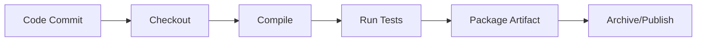
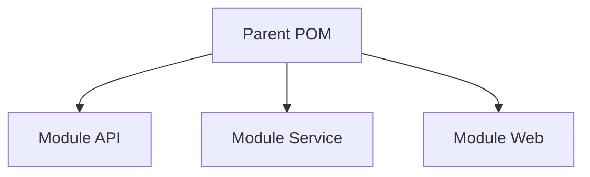
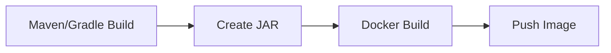
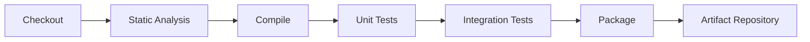

# Maven and Gradle Builds in Jenkins

Integrating **Maven** and **Gradle** builds into Jenkins enables automated compilation, testing, packaging, and artifact generation for Java-based projects.

Both tools are industry standards for Java build automation.

* **Maven** → Convention-driven, XML-based configuration.
* **Gradle** → Flexible, DSL-based, performance-oriented.

---

# 1. Why Integrate Build Tools with Jenkins

CI pipelines must:

* Compile source code
* Run unit tests
* Generate artifacts (JAR/WAR)
* Produce reports
* Publish build outputs

Jenkins orchestrates these steps.

---

# 2. High-Level Build Flow



---

# 3. Configuring Maven in Jenkins

## Step 1: Install Maven on Agent

Verify:

```bash
mvn -version
```

Or configure in Jenkins:

Manage Jenkins → Global Tool Configuration → Maven

Add:

* Name: `Maven-3.9`
* Version: Install automatically (recommended)

---

## Step 2: Basic Maven Pipeline

```groovy
pipeline {
    agent { label 'linux' }

    tools {
        maven 'Maven-3.9'
    }

    stages {
        stage('Checkout') {
            steps {
                checkout scm
            }
        }

        stage('Build') {
            steps {
                sh 'mvn clean package'
            }
        }
    }

    post {
        always {
            junit '**/target/surefire-reports/*.xml'
        }
    }
}
```

Key command:

**mvn clean package**

Lifecycle phases:

* clean
* compile
* test
* package
* install
* deploy

---

# 4. Maven Build with Profiles

For environment-specific builds:

```bash
mvn clean package -Pdev
```

Pipeline example:

```groovy
parameters {
    choice(name: 'PROFILE', choices: ['dev', 'qa', 'prod'])
}

stage('Build') {
    steps {
        sh "mvn clean package -P${params.PROFILE}"
    }
}
```

---

# 5. Publishing Maven Artifacts

Archive artifact:

```groovy
archiveArtifacts artifacts: 'target/*.jar', fingerprint: true
```

Or deploy to artifact repository:

```bash
mvn clean deploy
```

Requires `settings.xml` configuration.

---

# 6. Configuring Gradle in Jenkins

## Step 1: Install Gradle

Verify:

```bash
gradle -v
```

Or configure in Global Tool Configuration.

---

## Step 2: Basic Gradle Pipeline

```groovy
pipeline {
    agent any

    stages {
        stage('Checkout') {
            steps {
                checkout scm
            }
        }

        stage('Build') {
            steps {
                sh './gradlew clean build'
            }
        }
    }

    post {
        always {
            junit '**/build/test-results/test/*.xml'
        }
    }
}
```

Using wrapper (`gradlew`) ensures consistent versioning.

---

# 7. Maven vs Gradle Comparison

| Feature          | Maven                   | Gradle                    |
| ---------------- | ----------------------- | ------------------------- |
| Configuration    | XML (`pom.xml`)         | Groovy/Kotlin DSL         |
| Flexibility      | Convention-based        | Highly customizable       |
| Performance      | Slower for large builds | Faster incremental builds |
| Learning Curve   | Easier initially        | Slightly steeper          |
| Enterprise Usage | Very common             | Increasing rapidly        |

Choose based on project ecosystem.

---

# 8. Parallel Test Execution

Gradle:

```bash
./gradlew test --parallel
```

Maven:

```bash
mvn test -T 4
```

Integrate in pipeline to reduce execution time.

---

# 9. Caching Dependencies

To speed builds:

Mount Maven cache in Docker agent:

```groovy
agent {
    docker {
        image 'maven:3.9.6-eclipse-temurin-17'
        args '-v /root/.m2:/root/.m2'
    }
}
```

For Gradle:

```groovy
args '-v /home/jenkins/.gradle:/home/jenkins/.gradle'
```

Reduces dependency download time.

---

# 10. Test Reporting

JUnit integration:

```groovy
post {
    always {
        junit '**/target/surefire-reports/*.xml'
    }
}
```

This enables:

* Test history tracking
* Failure visualization
* Trend graphs

---

# 11. Multi-Module Project Pattern



Build command:

```bash
mvn clean install
```

Or selective module build:

```bash
mvn clean install -pl module-api
```

Gradle equivalent:

```bash
./gradlew :module-api:build
```

---

# 12. Integrating with Docker

Typical pattern:



Pipeline snippet:

```groovy
stage('Build Jar') {
    steps {
        sh 'mvn clean package'
    }
}

stage('Build Docker') {
    steps {
        sh 'docker build -t app:${BUILD_NUMBER} .'
    }
}
```

---

# 13. Common Issues

## 1. Build Fails with Dependency Errors

Cause:

* Repository unreachable
* Incorrect `settings.xml`

Fix:

* Verify internet access
* Configure proxy if required

---

## 2. Tests Not Reported in Jenkins

Cause:

* Incorrect report path

Fix:
Ensure correct path for:

* Maven → `target/surefire-reports`
* Gradle → `build/test-results/test`

---

## 3. Slow Builds

Cause:

* No dependency cache
* No parallelization

Fix:

* Enable caching
* Use wrapper
* Use incremental builds

---

# 14. Production Build Pattern



Static analysis tools like SonarQube can be inserted before packaging.

---

# Real-World Use Case

Scenario:
Java microservices company.

Pipeline design:

* Maven for build
* Surefire for tests
* JaCoCo for coverage
* Docker image built after packaging
* Artifacts pushed to repository
* Versioned tagging using Git commit

Outcome:

* Deterministic builds
* Test visibility
* Automated packaging
* Scalable deployment model

---

# Best Practices Summary

* Always use wrapper (`mvnw` or `gradlew`)
* Pin tool versions
* Enable test reporting
* Cache dependencies
* Separate build and deploy stages
* Archive artifacts
* Use profiles for environments
* Avoid building on controller

Maven and Gradle are execution engines. Jenkins orchestrates them. Clean separation ensures maintainable CI/CD pipelines.
