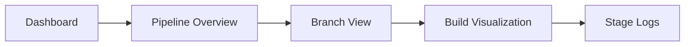
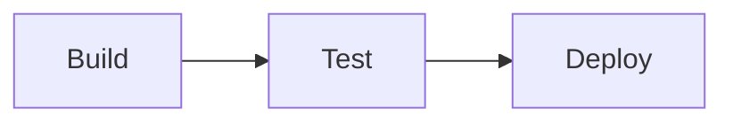
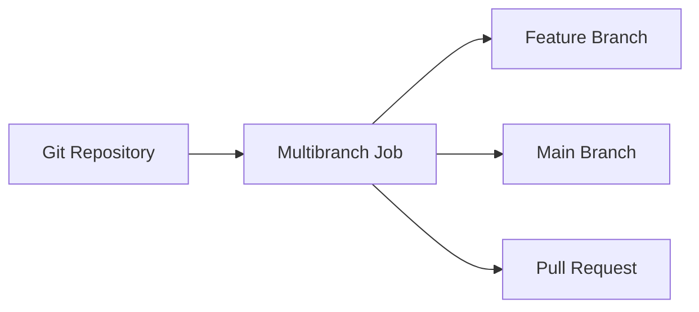
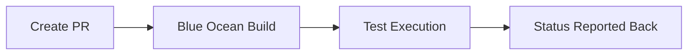
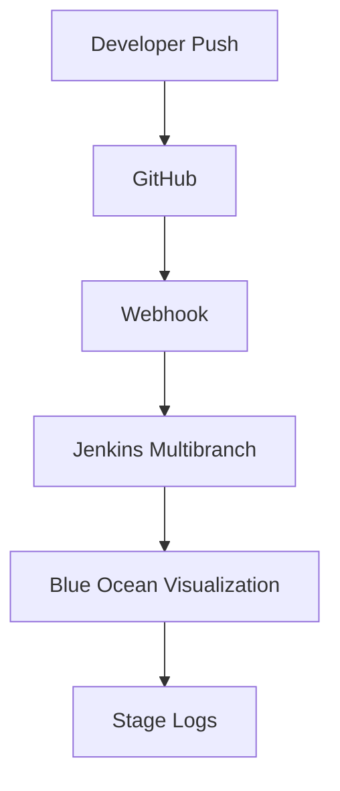

# Blue Ocean UI in Jenkins

**Blue Ocean** is a modern user interface for Jenkins designed specifically for visualizing and managing **Pipeline-as-Code** workflows.

It provides:

* Visual pipeline graphs
* Simplified job creation
* Branch and pull request views
* Clean build logs

It is optimized for Declarative Pipelines and multibranch workflows.

---

# 1. Why Blue Ocean Exists

The classic Jenkins UI:

* Is form-driven
* Was designed for Freestyle jobs
* Is harder to interpret for complex pipelines

Blue Ocean improves:

* Visualization
* Developer experience
* Pipeline debugging

---

# 2. Core Interface Components



Major elements:

* Dashboard
* Activity view
* Pipeline graph
* Branch management
* Pull request visualization

---

# 3. Installing Blue Ocean

Steps:

1. Manage Jenkins
2. Plugins
3. Install **Blue Ocean** plugin
4. Restart Jenkins

Access via:

```
http://jenkins-url/blue
```

---

# 4. Blue Ocean vs Classic UI

| Feature          | Classic UI       | Blue Ocean        |
| ---------------- | ---------------- | ----------------- |
| Designed For     | Freestyle jobs   | Pipeline jobs     |
| Visualization    | Basic stage view | Interactive graph |
| PR Support       | Limited          | Native            |
| Branch Discovery | Manual           | Automatic         |
| UX               | Legacy interface | Modern            |

Blue Ocean is recommended for pipeline-centric environments.

---

# 5. Pipeline Visualization

Example pipeline:

```groovy
pipeline {
    agent any
    stages {
        stage('Build') {
            steps { sh 'echo Build' }
        }
        stage('Test') {
            steps { sh 'echo Test' }
        }
        stage('Deploy') {
            steps { sh 'echo Deploy' }
        }
    }
}
```

Visualization:



Blue Ocean displays:

* Each stage as a visual block
* Duration metrics
* Success/failure indicators
* Clickable logs

---

# 6. Multibranch Pipeline Support

Blue Ocean automatically detects:

* Feature branches
* Main branch
* Pull requests

Flow:



Each branch gets:

* Separate build history
* Isolated pipeline execution

---

# 7. Pull Request Validation View

When integrated with GitHub:

* Pull requests appear automatically
* Status displayed visually
* Stage failures highlighted

PR workflow:



Developers can inspect logs without accessing classic UI.

---

# 8. Interactive Pipeline Editor

Blue Ocean offers a graphical pipeline editor for simple pipelines.

Features:

* Add stages visually
* Add steps via dropdown
* Generate Jenkinsfile

Limitations:

* Not suitable for complex scripted logic
* Limited advanced Groovy support

Serious production pipelines should be maintained in version control.

---

# 9. Real-Time Log Streaming

Blue Ocean provides:

* Stage-based logs
* Real-time streaming
* Clean separation per stage

Improves debugging speed.

---

# 10. Restart from Stage

If pipeline is configured properly:

* Failed stage can be restarted
* Previous successful stages are skipped

Requires:

* Declarative pipeline
* Durable task support

Useful for long-running deployments.

---

# 11. Limitations of Blue Ocean

* Limited updates in recent Jenkins ecosystem
* Some plugins better supported in classic UI
* Not ideal for heavy administrative tasks

Still widely used for:

* Developer-centric workflows
* Pipeline visualization

---

# 12. Security Considerations

Blue Ocean respects:

* Role-based access control
* Credentials masking
* Folder-level permissions

Access to branches depends on user permissions.

---

# 13. Production Workflow Pattern



Blue Ocean becomes the developer-facing CI interface.

---

# 14. When to Use Blue Ocean

Use when:

* Pipelines are primary job type
* Multibranch workflows exist
* Pull request validation is required
* Developer usability is important

Avoid relying solely on it for:

* Global configuration
* Plugin management
* System administration

Those remain in classic UI.

---

# Real-World Use Case

Scenario:
Microservices organization with GitHub-based development.

Implementation:

* Multibranch pipelines per repository
* Pull request validation builds
* Blue Ocean used by developers
* Classic UI restricted to DevOps administrators

Outcome:

* Developers self-serve pipeline logs
* Faster failure diagnosis
* Reduced DevOps bottleneck
* Clear visualization of stage duration

---

# Best Practices Summary

* Use Blue Ocean for pipeline visualization
* Maintain Jenkinsfile in version control
* Prefer multibranch pipelines
* Avoid complex edits in graphical editor
* Combine with webhook-based triggers
* Restrict admin actions to classic UI

Blue Ocean is a developer-facing visualization layer over Jenkins pipelines. It enhances clarity, not orchestration logic.
