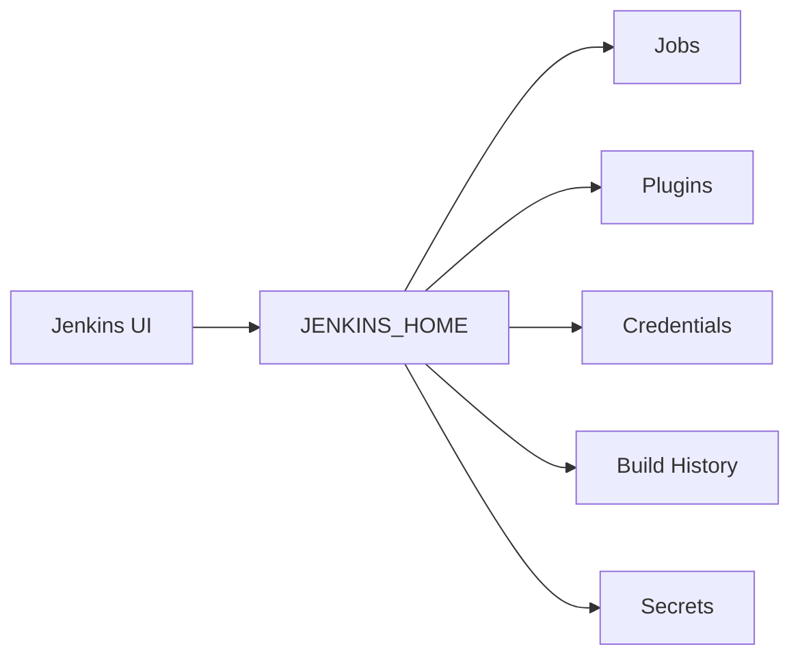

# Backup and Restore in Jenkins

## 1. Introduction

Jenkins stores all operational state inside **JENKINS_HOME**.

If this directory is lost, you lose:

* Jobs
* Pipelines
* Build history
* Credentials
* Plugins
* Configuration
* Agent definitions

Backup strategy is not optional in production environments.

---

## 2. What Must Be Backed Up

Primary directory:

```
$JENKINS_HOME
```

Default locations:

* Linux: `/var/lib/jenkins`
* Windows: `C:\Program Files\Jenkins`
* Docker: `/var/jenkins_home`

### Critical Subdirectories

| Path            | Purpose               |
| --------------- | --------------------- |
| jobs/           | Job configurations    |
| config.xml      | Global configuration  |
| credentials.xml | Encrypted credentials |
| plugins/        | Installed plugins     |
| secrets/        | Encryption keys       |
| nodes/          | Agent configurations  |
| users/          | User data             |
| builds/         | Build history         |

Never exclude `secrets/`. Without it, credentials cannot be decrypted after restore.

---

## 3. Understanding Jenkins Data Flow



All runtime state persists here.

---

## 4. Backup Strategies

### Strategy 1: File System Backup (Recommended)

Stop Jenkins, copy entire directory.

Linux:

```bash
sudo systemctl stop jenkins
sudo tar -czvf jenkins-backup.tar.gz /var/lib/jenkins
sudo systemctl start jenkins
```

Pros:

* Simple
* Reliable
* No plugin dependency

Cons:

* Short downtime required

---

### Strategy 2: Hot Backup (No Downtime)

Use filesystem snapshot:

* LVM snapshot
* EBS snapshot (AWS)
* VM snapshot
* NFS-level snapshot

Example for AWS EC2:

* Take snapshot of EBS volume
* Store snapshot ID
* Automate via cron or Lambda

Best for production.

---

### Strategy 3: Backup Plugin

Use **ThinBackup Plugin** or similar.

Steps:

1. Install plugin
2. Configure backup directory
3. Schedule periodic backup

Limitation:
Plugin-based backups may miss full consistency under heavy load.

File-level snapshot is safer.

---

## 5. Docker-Based Jenkins Backup

If Jenkins runs in Docker:

Check volume mapping:

```bash
docker inspect jenkins
```

Backup volume:

```bash
docker run --rm \
  -v jenkins_data:/data \
  -v $(pwd):/backup \
  ubuntu \
  tar czvf /backup/jenkins-backup.tar.gz /data
```

Never rely only on container image.

Container is ephemeral.
Volume holds the data.

---

## 6. Restore Procedure

### Step 1: Stop Jenkins

```bash
sudo systemctl stop jenkins
```

### Step 2: Replace JENKINS_HOME

```bash
sudo rm -rf /var/lib/jenkins/*
sudo tar -xzvf jenkins-backup.tar.gz -C /
```

### Step 3: Fix Permissions

```bash
sudo chown -R jenkins:jenkins /var/lib/jenkins
```

### Step 4: Start Jenkins

```bash
sudo systemctl start jenkins
```

Validate:

* Jobs visible
* Plugins loaded
* Credentials functional

---

## 7. Disaster Recovery Architecture


Production-grade setup:

* Nightly backup
* Offsite storage (S3, NFS, Object Storage)
* Secondary standby server

---

## 8. Backing Up Credentials Safely

Jenkins encrypts credentials using:

* master.key
* hudson.util.Secret
* secrets/ directory

If these are missing:
Credentials become unreadable.

Never copy credentials.xml alone.

Always include:

* credentials.xml
* secrets/
* master.key

---

## 9. Backup Frequency Strategy

| Environment   | Frequency        |
| ------------- | ---------------- |
| Dev           | Weekly           |
| QA            | Daily            |
| Production    | Daily + Snapshot |
| Enterprise CI | Every 4–6 hours  |

High-velocity pipelines require frequent snapshots.

---

## 10. Automating Backup with Cron

Example:

```bash
0 2 * * * tar -czvf /backup/jenkins-$(date +\%F).tar.gz /var/lib/jenkins
```

Better approach:

* Backup to remote object storage
* Retention policy (7/14/30 days)

---

## 11. Real-World Use Case

A production Jenkins instance running 300+ pipelines on AWS:

* EBS volume for JENKINS_HOME
* Nightly automated EBS snapshot
* Weekly full tar archive pushed to S3
* Standby EC2 with same Jenkins version
* Restore test performed quarterly

When instance corruption occurred:

* Volume replaced with snapshot
* Jenkins restored in under 20 minutes
* Zero pipeline reconfiguration required

---

## 12. Common Restore Failures

| Issue                   | Cause                    | Fix                       |
| ----------------------- | ------------------------ | ------------------------- |
| Credentials not working | secrets/ missing         | Restore full directory    |
| Plugins incompatible    | Jenkins version mismatch | Match original version    |
| Jobs missing            | Partial backup           | Restore full JENKINS_HOME |
| Permission denied       | Wrong file ownership     | chown properly            |

Always restore to same Jenkins version first.
Upgrade after validation.

---

## 13. Best Practices

* Version-lock Jenkins before backup
* Test restore quarterly
* Store backup offsite
* Encrypt backup archives
* Keep at least 7 historical copies
* Use infrastructure-as-code to recreate server
* Document restore procedure internally

---

## 14. Pro-Tip

Treat Jenkins as cattle, not pet.

Rebuild server via:

* Infrastructure as Code
* Configuration as Code (JCasC)
* Containerized deployment

Backup only:

* JENKINS_HOME
* External artifact storage
* Version-controlled pipeline libraries

This reduces recovery time from hours to minutes.

Backup is not complete until restore is tested.
