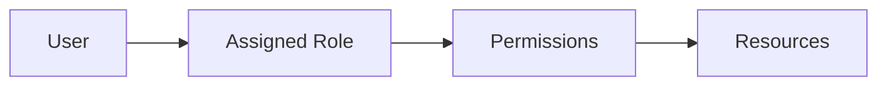
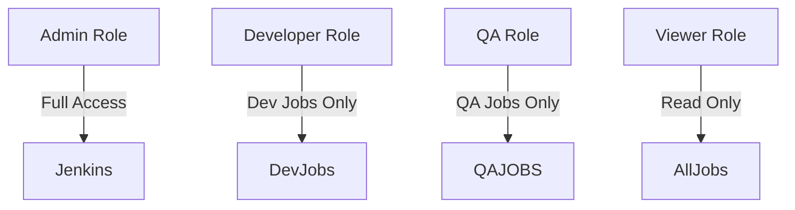

# Role-Based Access Control (RBAC) in Jenkins

## 1. Introduction

By default, Jenkins can operate in a highly permissive mode.
In production, unrestricted access leads to:

* Accidental job deletion
* Credential exposure
* Unauthorized deployments
* Plugin misconfiguration

**RBAC** enforces least privilege.
Users receive only the permissions required for their role.

---

## 2. Jenkins Security Model

Jenkins security consists of:

1. **Authentication** – Who are you?
2. **Authorization** – What can you do?

Authorization strategies:

* Matrix-based security
* Project-based matrix
* Role-based authorization (Recommended for enterprise)

RBAC is implemented using the **Role-Based Authorization Strategy Plugin**.

---

## 3. Why RBAC Instead of Matrix Security

| Feature          | Matrix Security      | Role-Based Strategy |
| ---------------- | -------------------- | ------------------- |
| Granularity      | User-level           | Role-level          |
| Scalability      | Poor for large teams | Designed for scale  |
| Maintainability  | Hard to manage       | Structured          |
| Enterprise usage | Limited              | Industry standard   |

Matrix becomes unmanageable beyond 10–15 users.

---

## 4. RBAC Architecture



Users do not get permissions directly.
They inherit permissions from assigned roles.

---

## 5. Installing RBAC Plugin

1. Manage Jenkins
2. Manage Plugins
3. Install **Role-Based Authorization Strategy**
4. Restart Jenkins

Then:

Manage Jenkins → Configure Global Security
Select **Role-Based Strategy**

---

## 6. Types of Roles

### 1. Global Roles

Control overall Jenkins access.

Examples:

* Admin
* Developer
* Read-only user

Permissions include:

* Overall/Administer
* Overall/Read
* Job/Create
* Job/Delete

---

### 2. Project Roles

Control access to specific jobs using regex patterns.

Example:

* Role: `dev-team`
* Pattern: `dev-.*`

Only jobs matching the pattern are accessible.

---

### 3. Agent Roles

Control access to build agents.

Useful in:

* Multi-node environments
* Environment segregation (dev/prod nodes)

---

## 7. Step-by-Step: Creating Roles

### Step 1: Create Global Role

Manage Jenkins → Manage and Assign Roles → Manage Roles

Example: Developer Role

Permissions:

* Overall/Read
* Job/Build
* Job/Read
* Job/Workspace

Do NOT grant:

* Administer
* Credential management

---

### Step 2: Create Project Role

Role name: `qa-team`
Pattern:

```
qa-.*
```

Permissions:

* Job/Build
* Job/Read
* Job/Cancel

---

### Step 3: Assign Roles

Manage and Assign Roles → Assign Roles

Map:

* user1 → developer
* user2 → qa-team
* admin → admin

---

## 8. Enterprise Role Model Example

| Role            | Permissions               |
| --------------- | ------------------------- |
| Admin           | Full control              |
| Dev             | Build + read              |
| QA              | Build specific jobs       |
| Viewer          | Read-only                 |
| Release Manager | Deploy + build production |

Production jobs typically restricted via regex:

```
prod-.*
```

Only release managers receive access.

---

## 9. Real-World Access Segmentation



Segmentation prevents cross-environment interference.

---

## 10. Integrating with Directory Services

Authentication commonly integrated with:

* LDAP
* Active Directory
* SSO providers

Best practice:

* Authentication handled externally
* Authorization handled via Jenkins RBAC

This ensures centralized identity management.

---

## 11. Common Misconfigurations

| Issue                      | Cause                         |
| -------------------------- | ----------------------------- |
| Users see all jobs         | Missing project regex         |
| Developers can delete jobs | Over-permissioned global role |
| No one can log in          | Admin role misconfigured      |
| Production job modified    | Weak role segregation         |

Always keep one emergency admin account.

---

## 12. Security Best Practices

* Apply principle of least privilege
* Separate production pipelines
* Restrict credential access
* Limit plugin management to admins
* Audit role assignments quarterly
* Disable anonymous access
* Use strong authentication (SSO/MFA)

---

## 13. Pro-Tip

Design roles before onboarding users.

Wrong approach:
Create users → Add permissions ad hoc.

Correct approach:
Define environment-based roles:

* Dev
* QA
* Prod
* Admin
* Observer

Then onboard users by mapping roles.

RBAC is a governance layer.
It prevents operational risk and enforces CI/CD discipline.
